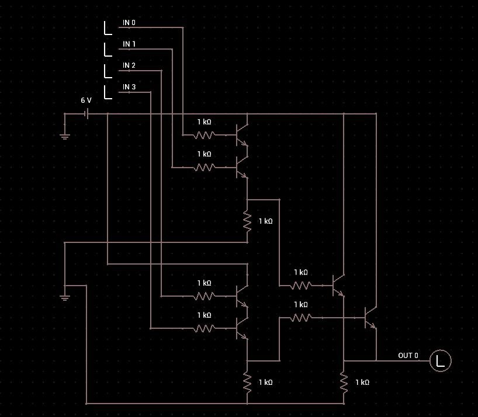

# HTB - Low Logic

## Description

> I have this simple chip, I want you to understand how it's works and then give me the output.

Challenge Link : [https://app.hackthebox.com/challenges/Low%2520Logic](https://app.hackthebox.com/challenges/Low%20Logic)

## Challenge

After downloading the zip file, we can unzip it with "hackthebox" password, and then we see an input.csv file and a chip.jpg file

<figure><figcaption></figcaption></figure>

<figure><figcaption></figcaption></figure>

ok, this is my first hardware challenge and I dont' have much clue on what to do here, but someone hinted me to look at how the transistors are used to construct logic gates. After googling for a while, I found [this page](https://www.instructables.com/Logic-Gates-with-NPN-transistors/) which talks about it. The interesting ones were the `AND` / `OR` gates. Here's how the `AND` gate look like

<figure><figcaption><p>AND gate</p></figcaption></figure>

only if both the inputs are high (1) , then the bulb is lit (output is 1), else 0. \
Then there is the `OR` gate where if either of them are conducting (1) , then the output is 1, and is 0 only if both of the inputs are 0.

<figure><figcaption><p>OR gate</p></figcaption></figure>

It then became easy to figure out the similaritess of our picture and the gates and I came to this conclusion.

<figure><figcaption></figcaption></figure>

so with this, we now know what to perform with the given inputs. It would be something like this&#x20;

<figure><figcaption></figcaption></figure>

So I wrote a small python script to do that for me with the given inputs and then print the output.

```python
with open("input.csv", "r") as f:
    lines = f.readlines()[1:]

output = ""

for line in lines:
    in0, in1, in2, in3 = map(int, line.strip().split(","))
    output += str((in0 & in1) | (in2 & in3))

print(output)

```

<figure><figcaption></figcaption></figure>

Seems like binary, I used cyberchef to convert it back and got the flag. GGs !

<figure><figcaption></figcaption></figure>
