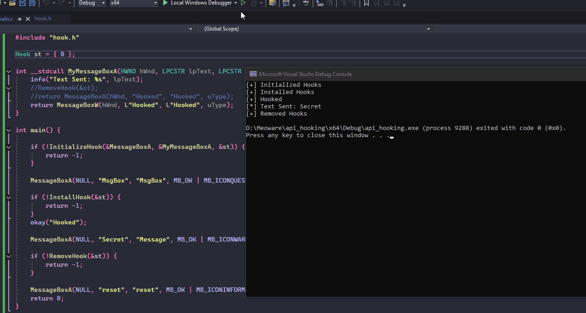

# API Hooking - Trampoline

## Theory

API hooking is a technique used to intercept and alter the behavior of different API calls. This can be done to monitor or modify the function of an application (used a lot in Game Hacking), etc. AV Vendors / EDR's also use it to monitor suspicious API calls and look at the parameters being passed to them, thereby detecting them before they get a chance to run. There are many different ways to do this, infact there are public libraries which can be used to do the same (Detours, Minhook) but using them will clearly indicate that we are trying to hook the API calls, hence we write a manual code to do the same.

What we will basically do is update the target's function prologue (initial instructions) before saving the real instructions and tell it to do an unconditional jump to our new function, in which we will verify/print the args, restore the original code for the targeted function, and run the actual function with the args. To keep things simple, I will try hooking the `MessageBoxA` API.

1. Read the function prologue for `MessageBoxA`&#x20;
2. Modify the perms to RWX, since we have to write + execute
3. Update it with unconditional jump to our `HookedMessageBoxA`&#x20;
4. Print Args, Run `MessageBoxW` instead
5. Reset the perms back for `MessageBoxA`
6. Unhook `MessageBoxA`

We need to keep track of a few things like actual instructions, target function, function to run instead, perms on the actual instructions, so it's better to define a struct to handle all of these.

## Trampolines

The shellcode which will be updated could also be called a trampoline. We need to have different trampoline based on the system architecture. We could also do this in a way how Detours implements this, more on this below. On x64, it would look something like this.&#x20;

```
mov rax, 0x1122334411223344 ; update rax with function val then jmp
jmp rax
```

and on x86, we could do something like

```
push 0xa0b1c2d3 ; push the function address to stack and ret
ret
```

But when we read the first instructions from the target function, they are going to be in hex (opcodes). Hence, we need to update our trampolines to opcodes as well. I'll use [godbolt](https://godbolt.org/) to achieve the same.

<figure><figcaption></figcaption></figure>

```
mov rax, 0x1122334411223344   ; 48 b8 11 22 33 44 11 22 33 44
jmp rax        ; ff e0
```

&#x20;for x86, I had some trouble working with godbolt, so i switched to [defuse](https://defuse.ca/online-x86-assembler.htm#disassembly) for the same.

<figure><figcaption></figcaption></figure>

```
push   0x11223344    ;    68 44 33 22 11
ret                  ;    c3
```

## Implementation

Alright, We have our trampolines ready. I'll start with defining functions to install and remove the hook.

### Hook Struct

I'll create a structure for my ease

```c
typedef struct _Hook {
	PVOID pTargetfn;
	PVOID pDetourfn;
	BYTE ogBytes[TRAMPOLINE_SIZE];
	DWORD dwOldProtect;
	BOOL bInstalled;
}Hook, *pHook;
```

Now I'll have to Initialize the hook, I will have to copy the original opcodes first, then update the perms for that memory, and finally write my trampoline.

### InitializeHook

```c
BOOL InitializeHook(IN PVOID pTargetfn, IN PVOID pDetourfn, OUT pHook Hook) {

	Hook->pTargetfn = pTargetfn;
	Hook->pDetourfn = pDetourfn;

	memcpy(Hook->ogBytes, pTargetfn, TRAMPOLINE_SIZE);

	if (!VirtualProtect(pTargetfn, TRAMPOLINE_SIZE, PAGE_EXECUTE_READWRITE, &Hook->dwOldProtect)) {
		printf("[!] VirtualProtect Failed With Error : %d \n", GetLastError());
		return FALSE;
	}
	okay("Initialized Hooks");
	return TRUE;
}
```

### InstallHook

After we have initialized our hook, now we need to have 2 more functions for installing and removing the hook. I'll make sure of the architecture and update the trampoline accordingly. Here, there's also another way to do the trampoline like how it's implemented in Detours. I'll show that later on.

```c
BOOL InstallHook(pHook Hook) {

#ifdef _M_X64
	unsigned char uTrampoline[] = {
			0x48, 0xB8, 0x00, 0x00, 0x00, 0x00, 0x00, 0x00, 0x00, 0x00, // mov rax, pDetourfn
			0xFF, 0xE0                                            // jmp rax
	};

	unsigned long long uPatch = (unsigned long long)(Hook->pDetourfn);
	memcpy(&uTrampoline[2], &uPatch, sizeof(uPatch));
#endif // _M_X64

#ifdef _M_IX86
	// 32-bit trampoline
	unsigned char uTrampoline[] = {
	   0xB8, 0x00, 0x00, 0x00, 0x00,     // mov eax, pDetourfn
	   0xFF, 0xE0                        // jmp eax
	};

	unsigned int uPatch = (unsigned int)(Hook->pFunctionToRun);
	memcpy(&uTrampoline[1], &uPatch, sizeof(uPatch));
#endif // _M_IX86

	memcpy(Hook->pTargetfn, uTrampoline, sizeof(uTrampoline));
	okay("Installed Hooks");
	Hook->bInstalled = TRUE;

	return TRUE;
}
```

### RemoveHook

We will first reset the function prologue and then reset the updated perms on the function, and then we set the other variables to `NULL`.

```c
BOOL RemoveHook(IN pHook Hook) {
	if (Hook->bInstalled == FALSE) return FALSE;
	DWORD	dwOld = NULL;

	memcpy(Hook->pTargetfn, Hook->ogBytes, TRAMPOLINE_SIZE);
	if (!VirtualProtect(Hook->pTargetfn, TRAMPOLINE_SIZE, Hook->dwOldProtect, &dwOld)) {
		printf("[!] VirtualProtect Failed With Error : %d \n", GetLastError());
		return FALSE;
	}

	Hook->pTargetfn = NULL;
	Hook->pDetourfn = NULL;
	Hook->dwOldProtect = NULL;

	okay("Removed Hooks");

	return TRUE;
}
```

### main

Now all that's left is to implement it and hook the `MessageBoxA`.

```c
Hook st = { 0 };

int __stdcall MyMessageBoxA(HWND hWnd, LPCSTR lpText, LPCSTR lpCaption, UINT uType) {
	info("Text Sent: %s", lpText);
	//RemoveHook(&st);
	//return MessageBoxA(hWnd, "Hooked", "Hooked", uType);
	return MessageBoxW(hWnd, L"Hooked", L"Hooked", uType);
}

int main() {

	if (!InitializeHook(&MessageBoxA, &MyMessageBoxA, &st)) {
		return -1;
	}

	MessageBoxA(NULL, "MsgBox", "MsgBox", MB_OK | MB_ICONQUESTION);

	if (!InstallHook(&st)) {
		return -1;
	}
	okay("Hooked");
	
	MessageBoxA(NULL, "Secret", "Message", MB_OK | MB_ICONWARNING);

	if (!RemoveHook(&st)) {
		return -1;
	}

	MessageBoxA(NULL, "reset", "reset", MB_OK | MB_ICONINFORMATION);
	return 0;
}
```

Again there many ways to implement this. If i want to remove the hook when I call my custom messagebox, I would want to use a global `Hook` object, else I would have to rely on calling the `MessageBoxW` instead. This might be handy just for showcasing hooking, but not the best way imo. I'll update and introduce a different way to hook the apis, but that's for some other day.

<figure><figcaption></figcaption></figure>

Looking at x64dbg, we can confirm the function prologue being updated to our trampoline.

<figure><figcaption></figcaption></figure>

Visiting the function, we can see that the particular address is pointing to our detour function

<figure><figcaption></figcaption></figure>

<figure><figcaption></figcaption></figure>

## Detours way

Looking at the src for [Detours](https://github.com/microsoft/Detours/blob/main/src/detours.cpp), we can see how they have implemented the trampoline.

```c
inline PBYTE detour_gen_jmp_immediate(PBYTE pbCode, PBYTE pbJmpVal)
{
    PBYTE pbJmpSrc = pbCode + 5;
    *pbCode++ = 0xE9;   // jmp +imm32
    *((INT32*&)pbCode)++ = (INT32)(pbJmpVal - pbJmpSrc);
    return pbCode;
}

inline PBYTE detour_gen_jmp_indirect(PBYTE pbCode, PBYTE *ppbJmpVal)
{
    *pbCode++ = 0xff;   // jmp [+imm32]
    *pbCode++ = 0x25;
    *((INT32*&)pbCode)++ = (INT32)((PBYTE)ppbJmpVal);
    return pbCode;
}
```

The Trampoline uses the instruction `jmp qword ptr [rip+0]` (`FF 25 00 00 00 00`), which tells the CPU to read a 64-bit pointer from memory located at the current instruction pointer (RIP) plus a displacement. When the instruction is executed, the CPU first advances RIP to the next instruction (6 bytes ahead), then calculates the effective address `RIP + 0`, reads the 8-byte value stored there, and jumps to that address. By placing the target function’s address immediately after the instruction, the trampoline creates an absolute jump without using any registers.

I'll use [godbolt](https://godbolt.org/) and get the opcodes, I'll only have to update the memcpy function to adjust the address accordingly, rest everything is the same.

```c
unsigned char uTrampoline[] = {
  0xFF,0x25,0x00,0x00,0x00,0x00,
  0x00,0x00,0x00,0x00,0x00,0x00,0x00,0x00
};

unsigned long long uPatch = (unsigned long long)(Hook->pDetourfn);
memcpy(&uTrampoline[6], &uPatch, sizeof(uPatch));
```

## Conclusion

This was me using trampoline to hook winapis. As usual I have uploaded the full source on [github](https://github.com/ZzN1NJ4/Malware-Development/blob/main/API%20Hooking%20-%20Trampoline/hook.h), and you can reach out to me on twitter ([@ZzN1NJ4](https://x.com/ZzN1NJ4)) if you find any mistakes (I have this weird feeling that I made some mistake which I'll find after reading this thrice). Thanks again. There are soo many things to do, but maybe I'll talk about IAT Hooking next.

## References

* [https://godbolt.org/](https://godbolt.org/)
* [https://shell-storm.org/online/Online-Assembler-and-Disassembler/](https://shell-storm.org/online/Online-Assembler-and-Disassembler/)
* [https://defuse.ca/online-x86-assembler.htm#disassembly](https://defuse.ca/online-x86-assembler.htm#disassembly)
* [https://github.com/microsoft/Detours/blob/main/src/detours.cpp](https://github.com/microsoft/Detours/blob/main/src/detours.cpp)
