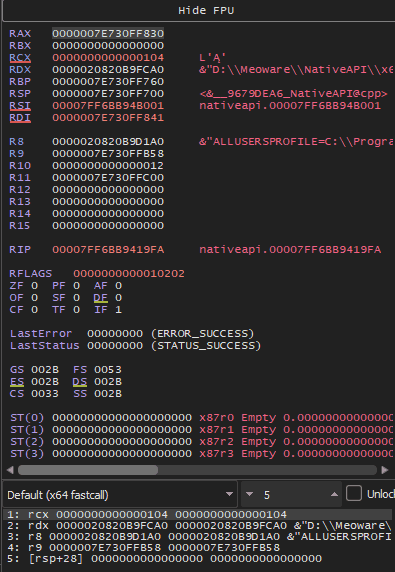

# Reversing with x64dbg

## Overview

Reverse Engineering is simply the act of dismantling stuff to take a look at its inner workings. Reversing Malware or any other is just simply using different tools to "dissect" the program and take a look at its assembly code, and further infer what could the program be doing based on that. I'll use [x64dbg](https://x64dbg.com/) to reverse our NTAPI process injection (the code can be found on [my github](https://github.com/ZzN1NJ4/Malware-Development/tree/main/NtAPI)). Note that I have removed the part where I modify the shellcode just before execution. I also will show reversing with [Ghidra](https://ghidra-sre.org/) later and also show reversing the Rust Malware. If you are following/reading through (ily).

## Reversing Malware

After we have loaded the executable into the debugger, we have to set the arguments for it (PID of the process)


<div align="center"><figure><figcaption></figcaption></figure></div>

<div align="center" data-full-width="false"><figure><figcaption><p>Changing the cmd argument</p></figcaption></figure></div>

After this, we can reload once (not necessary but I do I), and then click on **Run** once, by doing so , the debugger will stop you at the `mainCRTStartup` function which is the **entry point** of our executable. An **entry point** is the actual starting point of execution for any executable. This is by default how the x64dbg works. Now we can switch to the **symbols** tab.

<figure><figcaption></figcaption></figure>

The **symbols** tab consists of all the "symbols" loaded in the executable, We can see the **DLLs** and apart from that our own executable. When clicking on it, we can see a list of different symbols present in that file. We can search for "main" function and double click on it to get to the start of the main function.

<figure><figcaption></figcaption></figure>

We can clearly see the declaration of our shellcode variable and the print statements inside the **`main`** function. The initial assembly code is mainly to align the stack , set the base pointer, etc.&#x20;

<figure><figcaption></figcaption></figure>

<figure><figcaption></figcaption></figure>

We can hover over the **`call`** instruction to see what function it is calling, in our case it is the  `__CheckForDebuggerJustMyCode` which is a Microsoft feature called "[Just My Code](https://learn.microsoft.com/en-us/cpp/build/reference/jmc?view=msvc-170)". According to them, It is enabled by default from the latest Visual Studio 2017 (15.8) and it helps to automatically step over calls to system, framework, and other non-user code, hence the name. Moving on, we see a total of 6 **`mov`** instructions before the initialization of shellcode (`bin`), all of them moving the value 0 which aligns with what we did in our code, initialized 6 variables with `NULL` value.

We can setup a breakpoint by pressing F2 on the desired line (I did before shellcode initialization), and then click on Run again to hit the breakpoint.&#x20;

<figure><figcaption></figcaption></figure>

We see 2 **`lea`** commands which loads the memory address of source to destination (check [here](https://reze.gitbook.io/bin/assembly-x86/x86-architecture-overview#lea)). We can check what the memory at `[rbp+D0]` contains from the command line at the bottom, just type `rbp+D0` to get the address, and to get the value we can enter any address in square brackets `[]`.&#x20;

<figure><figcaption></figcaption></figure>

For now, it doesn't seem much happening so let's move forward for now, the address of shellcode has been loaded into the **`rcx`** register. We can confirm this again with the command line, if we type `[rcx]` we will see `00C0E8F0E48348FC` which is our shellcode in reverse (due to [little endian](https://www.geeksforgeeks.org/little-and-big-endian-mystery/)). Then we see mov instructions, `rax --> rdi` , `rcx --> rsi`and the value 115 is moved into `ecx`. Since this is in hex, we can check what 115 is in hex using cmdline python (just type 0x115) and it tells us 277 in decimal which is the size of our shellcode.&#x20;

So `ecx` holds the size of shellcode, `rsi` holds the address of it, and we don't know what `rdi` has. But, if you know what these registers mean (check [here](https://reze.gitbook.io/bin/assembly-x86/x86-architecture-overview#eax-or-rax)), then it does make some sense. `ecx` is the counter, `rsi` is the source operand and thus `rdi` will be the destination. We can see the **`rep movsb`** command which will repeat the [**`movsb`**](https://faydoc.tripod.com/cpu/movsb.htm) command. It means that the source `[rsi]` will get copied **byte by byte** to `[rdi]` destination until the counter `[ecx]` is not 0. You can see below, if I click on "Step into" , the rcx keeps decrementing.

<figure><figcaption></figcaption></figure>

Then we can see that there is a `cmp` operation which will check if the src with the value 2, this is where we have our if statement to check the number of arguments given to the program. We can see that the debugger tells us that the jmp is taken (this can change when reached the statement), although we can manipulate the value at the source such that the jmp is not taken.

<figure><figcaption></figcaption></figure>

After taking the jmp, we see that `eax` gets the value 8 and `rax` gets the value `rax * 1` (that's how **`imul`** works). Then we can see 2 `mov` instructions and then finally a call to the `atoi()` function. If we look carefully, the first instruction sets rcx to `[rbp+508]` and the next sets `rcx` to `[rcx+rax]`.  We can see that those are the arguments provided by us, just for testing I had changed the cmdline to include two more words. We can type `[rbp+508]` to go to that address.

<figure><figcaption></figcaption></figure>

<figure><figcaption></figcaption></figure>

At first I thought that the arguments are from `PEB`, but quickly realized that's not the case. It seems that the `argc` & `argv` are **stored in the stack** probably for easy access and also the fact that it's stored in unicode format in PEB. Anyways, moving on, after the `atoi()` function call, we see the value stored in `rax` is `0x17A0` and if we change this hex to int, it gives 6048 (I had restarted notepad more than once, so PID doesn't match with previous pics) which is the PID of the notepad (that seems to be the return value of atoi).

Then, we see the string "NTDLL" being saved into `rcx` and then a call to `Modder` function. I'll leave this to the reader and move forward (It's just a function to get handle for NTDLL). After getting the handle, We get all the necessary functions within NTDLL using the `GetProcAddress` function.

```nasm
lea rcx, qword ptr ds:[<"[*] Getting Necessary Functions"...>]
call nativeapi.7FF727F8119F ; printf
lea rdx, qword ptr ds:[<"NtOpenProcess">]   ; rdx:"NtOpenProcess"
mov rcx, qword ptr ss:[rbp+48]
call qword ptr ds:[<&GetProcAddress>]
mov qword ptr ss:[rbp+248], rax
lea rdx, qword ptr ds:[<"NtCreateThreadEx">]   ; rdx:"NtCreateThreadEx"
mov rcx, qword ptr ss:[rbp+48]
call qword ptr ds:[<&GetProcAddress>]
mov qword ptr ss:[rbp+268], rax
lea rdx, qword ptr ds:[<"NtAllocateVirtualMemory">]   ; rdx:"NtAllocateVirtualMemory"
mov rcx, qword ptr ss:[rbp+48]
call qword ptr ds:[<&GetProcAddress>]
mov qword ptr ss:[rbp+288], rax
lea rdx, qword ptr ds:[<"NtWriteVirtualMemory">]   ; rdx:"NtWriteVirtualMemory"
mov rcx, qword ptr ss:[rbp+48]
call qword ptr ds:[<&GetProcAddress>]
mov qword ptr ss:[rbp+2A8], rax
lea rdx, qword ptr ds:[<"NtClose">]   ; rdx:"NtClose"
mov rcx, qword ptr ss:[rbp+48]
call qword ptr ds:[<&GetProcAddress>]
```

The next seems to be initializing some variables/objects and then a print function and finally what seems to be a call to the `NtOpenProcess` function. The parameters are passed in a particular order in Windows and that is **`rcx -> rdx -> r8 -> r9 -> stack`**. So, the first parameter goes to `rcx` and 2nd to `rdx` , so on and so forth, But that depends on the [calling convention](https://learn.microsoft.com/en-us/cpp/cpp/argument-passing-and-naming-conventions?view=msvc-170) which I'll talk about in some other post. (Although I have seen it being ignored idk why, but if you know pls let me know as well).

<figure><figcaption></figcaption></figure>

We can also see the number `0x1FFFFF` in `edx` which is what the `PROCESS_ALL_ACCESS` means (check msdn or [this](https://threathunterplaybook.com/library/windows/process_access_rights.html)). Now if we see the code for `NtOpenProcess`, It moves the value in `rcx` to `r10` and that is because for system calls, the first argument should be in `r10` register instead of the `rcx` register. After that, the number `0x26` is moved to `eax`, this is a <mark style="color:orange;">**syscall number**</mark>. It is mostly the functions in `ntdll` that have a syscall number or the <mark style="color:orange;">**SSN**</mark> (**System Service Number)** and that's because they are the one's responsible for interacting with the **Kernel**. The test is to check if it should do a `syscall` or `int 2E`, which was the way windows used to do a syscall. It is still here because of backward compatibility. After this we see the next function `NtAllocateVirtualMemory`.

<figure><figcaption></figcaption></figure>

<figure><figcaption></figcaption></figure>

And judging from the parameters, it seems that the Malware is allocating memory in the victim process of size the same as the shellcode. And if the return value `eax` is equal to 0, then it moves forward else it prints the error message (`GetLastError`) and exits.

<figure><figcaption></figcaption></figure>

Same flow is followed with the `WriteProcessMemory` api. Checking the parameters from command, it seems that it writes the shellcode into the buffer allocated from `NtAllocateVirtualMemory`.

<figure><figcaption></figcaption></figure>

Then the long list of parameters initialized for `CreateThreadEx` function. And the Allocated Memory provided as the function (shellcode).

<figure><figcaption></figcaption></figure>

And as soon as we step onto the next instruction right after the `CreateThreadEx` function, we see a calculator spawning. Finally it calls the `WaitForSingleObject` function and the `NtClose` function to close the handles it had opened for the process.

## References

* [https://www.felixcloutier.com/x86/imul](https://www.felixcloutier.com/x86/imul)
* [https://threathunterplaybook.com/library/windows/process\_access\_rights.html](https://threathunterplaybook.com/library/windows/process_access_rights.html)
* [https://reze.gitbook.io/bin/assembly-x86/x86-architecture-overview](https://reze.gitbook.io/bin/assembly-x86/x86-architecture-overview)
* [https://help.x64dbg.com/en/latest/introduction/index.html](https://help.x64dbg.com/en/latest/introduction/index.html)
