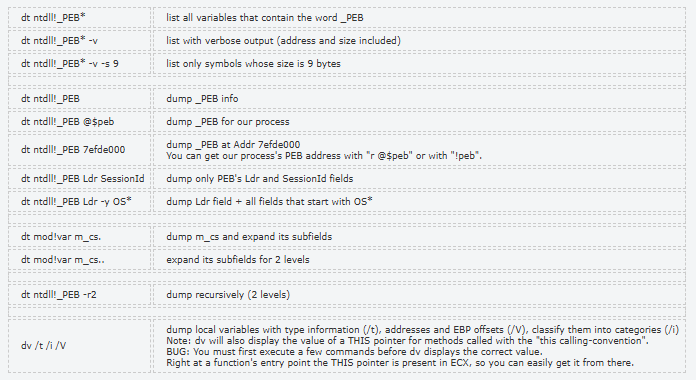

# Dissecting PE with WinDbg

The aim of this post is to get better at windbg, and also get a better understanding of the PE Structure. Alright so without wasting any time, I'll start with opening WinDbg and starting notepad.exe or just attach the debugger to it if already started.&#x20;

This is what we would see when we first attach the debugger.

```asm
*** wait with pending attach

************* Path validation summary **************
Response                         Time (ms)     Location
Deferred                                       srv*
Symbol search path is: srv*
Executable search path is: 
ModLoad: 00007ff6`fa9a0000 00007ff6`fa9d8000   C:\Windows\system32\notepad.exe
ModLoad: 00007ffc`6f1b0000 00007ffc`6f3a8000   C:\Windows\SYSTEM32\ntdll.dll
ModLoad: 00007ffc`6ea10000 00007ffc`6ead2000   C:\Windows\System32\KERNEL32.DLL
ModLoad: 00007ffc`6cec0000 00007ffc`6d1b7000   C:\Windows\System32\KERNELBASE.dll
ModLoad: 00007ffc`6e150000 00007ffc`6e17b000   C:\Windows\System32\GDI32.dll
ModLoad: 00007ffc`6cd30000 00007ffc`6cd52000   C:\Windows\System32\win32u.dll
ModLoad: 00007ffc`6c830000 00007ffc`6c949000   C:\Windows\System32\gdi32full.dll
ModLoad: 00007ffc`6c950000 00007ffc`6c9ed000   C:\Windows\System32\msvcp_win.dll
ModLoad: 00007ffc`6cc30000 00007ffc`6cd30000   C:\Windows\System32\ucrtbase.dll
ModLoad: 00007ffc`6eea0000 00007ffc`6f03d000   C:\Windows\System32\USER32.dll
ModLoad: 00007ffc`6e3d0000 00007ffc`6e723000   C:\Windows\System32\combase.dll
ModLoad: 00007ffc`6eb40000 00007ffc`6ec66000   C:\Windows\System32\RPCRT4.dll
ModLoad: 00007ffc`6e800000 00007ffc`6e8ad000   C:\Windows\System32\shcore.dll
ModLoad: 00007ffc`6e970000 00007ffc`6ea0e000   C:\Windows\System32\msvcrt.dll
ModLoad: 00007ffc`56df0000 00007ffc`5708b000   C:\Windows\WinSxS\amd64_microsoft.windows.common-controls_6595b64144ccf1df_6.0.19041.6926_none_60b5a53971f8f7e6\COMCTL32.dll
ModLoad: 00007ffc`6e0c0000 00007ffc`6e0ef000   C:\Windows\System32\IMM32.DLL
ModLoad: 00007ffc`6cba0000 00007ffc`6cc22000   C:\Windows\System32\bcryptPrimitives.dll
ModLoad: 00007ffc`6e8b0000 00007ffc`6e961000   C:\Windows\System32\ADVAPI32.dll
ModLoad: 00007ffc`6e180000 00007ffc`6e21f000   C:\Windows\System32\sechost.dll
ModLoad: 00007ffc`6cb70000 00007ffc`6cb97000   C:\Windows\System32\bcrypt.dll
ModLoad: 00007ffc`6a6d0000 00007ffc`6a6e2000   C:\Windows\SYSTEM32\kernel.appcore.dll
ModLoad: 00007ffc`6a1e0000 00007ffc`6a27e000   C:\Windows\system32\uxtheme.dll
ModLoad: 00007ffc`6db00000 00007ffc`6dba9000   C:\Windows\System32\clbcatq.dll
ModLoad: 00007ffc`5e6e0000 00007ffc`5e7d8000   C:\Windows\System32\MrmCoreR.dll
ModLoad: 00007ffc`6d380000 00007ffc`6daf2000   C:\Windows\System32\SHELL32.dll
ModLoad: 00007ffc`6a8d0000 00007ffc`6b076000   C:\Windows\SYSTEM32\windows.storage.dll
ModLoad: 00007ffc`6c190000 00007ffc`6c1bb000   C:\Windows\system32\Wldp.dll
ModLoad: 00007ffc`6f0a0000 00007ffc`6f16d000   C:\Windows\System32\OLEAUT32.dll
ModLoad: 00007ffc`6eae0000 00007ffc`6eb3b000   C:\Windows\System32\shlwapi.dll
ModLoad: 00007ffc`6ed60000 00007ffc`6ee75000   C:\Windows\System32\MSCTF.dll
ModLoad: 00007ffc`57240000 00007ffc`572ec000   C:\Windows\system32\TextShaping.dll
ModLoad: 00007ffc`4a940000 00007ffc`4aa1e000   C:\Windows\System32\efswrt.dll
ModLoad: 00007ffc`5fff0000 00007ffc`6000d000   C:\Windows\System32\MPR.dll
ModLoad: 00007ffc`67e90000 00007ffc`67fe7000   C:\Windows\SYSTEM32\wintypes.dll
ModLoad: 00007ffc`66250000 00007ffc`66453000   C:\Windows\System32\twinapi.appcore.dll
ModLoad: 00007ffc`53190000 00007ffc`531f6000   C:\Windows\System32\oleacc.dll
ModLoad: 00007ffc`5a710000 00007ffc`5a809000   C:\Windows\SYSTEM32\textinputframework.dll
ModLoad: 00007ffc`699f0000 00007ffc`69ae2000   C:\Windows\System32\CoreMessaging.dll
ModLoad: 00007ffc`69310000 00007ffc`6966b000   C:\Windows\System32\CoreUIComponents.dll
ModLoad: 00007ffc`6e790000 00007ffc`6e7fb000   C:\Windows\System32\WS2_32.dll
ModLoad: 00007ffc`6ba60000 00007ffc`6ba93000   C:\Windows\SYSTEM32\ntmarta.dll
(174c.f7c): Break instruction exception - code 80000003 (first chance)
ntdll!DbgBreakPoint:
00007ffc`6f251180 cc              int     3
```

The debugger loads the main executable and then all the other DLLs which are required by it. One thing to note is that the `NTDLL.dll` is almost always loaded as the first dll since it is always required for handling the transition from user mode to kernel mode. We can also see the address range for the dll which are loaded and also the base address of the exe (`00007ff6fa9a0000`).

## Loading Symbols

First things first, we have to load the symbols for windbg. This is to make sure that windbg can resolve internal structures like the `_TEB` and `_PEB`. After which we can run `.cls` to clear the screen.

```asm
0:007> .sympath srv*C:\Symbols*https://msdl.microsoft.com/download/symbols
Symbol search path is: srv*C:\Symbols*https://msdl.microsoft.com/download/symbols
Expanded Symbol search path is: srv*c:\symbols*https://msdl.microsoft.com/download/symbols

************* Path validation summary **************
Response                         Time (ms)     Location
Deferred                                       srv*C:\Symbols*https://msdl.microsoft.com/download/symbols
0:007> .reload
Reloading current modules
.........................................
```

## TEB & PEB

There are n no. of ways to read the TEB and PEB, I'll show the easiest ones.

```asm
0:007> dt _TEB @$teb
combase!_TEB
   +0x000 NtTib            : _NT_TIB
   +0x038 EnvironmentPointer : (null) 
   +0x040 ClientId         : _CLIENT_ID
   +0x050 ActiveRpcHandle  : (null) 
   +0x058 ThreadLocalStoragePointer : (null) 
   +0x060 ProcessEnvironmentBlock : 0x00000096`4ecbf000 _PEB
   +0x068 LastErrorValue   : 0
   +0x06c CountOfOwnedCriticalSections : 0
   +0x070 CsrClientThread  : (null) 
   +0x078 Win32ThreadInfo  : (null) 
   +0x080 User32Reserved   : [26] 0
   +0x0e8 UserReserved     : [5] 0
   +0x100 WOW32Reserved    : (null) 
   +0x108 CurrentLocale    : 0x4c09
   +0x10c FpSoftwareStatusRegister : 0
   +0x110 ReservedForDebuggerInstrumentation : [16] (null) 
   +0x190 SystemReserved1  : [30] (null) 
   +0x280 PlaceholderCompatibilityMode : 0 ''
   +0x281 PlaceholderHydrationAlwaysExplicit : 0 ''
   +0x282 PlaceholderReserved : [10]  ""
   +0x28c ProxiedProcessId : 0
   +0x290 _ActivationStack : _ACTIVATION_CONTEXT_STACK
   +0x2b8 WorkingOnBehalfTicket : [8]  ""
   +0x2c0 ExceptionCode    : 0n0
   +0x2c4 Padding0         : [4]  ""
   +0x2c8 ActivationContextStackPointer : 0x00000096`4ecce290 _ACTIVATION_CONTEXT_STACK
   +0x2d0 InstrumentationCallbackSp : 0
   +0x2d8 InstrumentationCallbackPreviousPc : 0
   +0x2e0 InstrumentationCallbackPreviousSp : 0
   +0x2e8 TxFsContext      : 0xfffe
   +0x2ec InstrumentationCallbackDisabled : 0 ''
   +0x2ed UnalignedLoadStoreExceptions : 0 ''
   +0x2ee Padding1         : [2]  ""
   +0x2f0 GdiTebBatch      : _GDI_TEB_BATCH
   +0x7d8 RealClientId     : _CLIENT_ID
   +0x7e8 GdiCachedProcessHandle : (null) 
   +0x7f0 GdiClientPID     : 0
   +0x7f4 GdiClientTID     : 0
   +0x7f8 GdiThreadLocalInfo : (null) 
   +0x800 Win32ClientInfo  : [62] 0
   +0x9f0 glDispatchTable  : [233] (null) 
   +0x1138 glReserved1      : [29] 0
   +0x1220 glReserved2      : (null) 
   +0x1228 glSectionInfo    : (null) 
   +0x1230 glSection        : (null) 
   +0x1238 glTable          : (null) 
   +0x1240 glCurrentRC      : (null) 
   +0x1248 glContext        : (null) 
   +0x1250 LastStatusValue  : 0
   +0x1254 Padding2         : [4]  ""
   +0x1258 StaticUnicodeString : _UNICODE_STRING ""
   +0x1268 StaticUnicodeBuffer : [261]  ""
   +0x1472 Padding3         : [6]  ""
   +0x1478 DeallocationStack : 0x00000096`4f000000 Void
   +0x1480 TlsSlots         : [64] (null) 
   +0x1680 TlsLinks         : _LIST_ENTRY [ 0x00000000`00000000 - 0x00000000`00000000 ]
   +0x1690 Vdm              : (null) 
   +0x1698 ReservedForNtRpc : (null) 
   +0x16a0 DbgSsReserved    : [2] (null) 
   +0x16b0 HardErrorMode    : 0
   +0x16b4 Padding4         : [4]  ""
   +0x16b8 Instrumentation  : [11] (null) 
   +0x1710 ActivityId       : _GUID {00000000-0000-0000-0000-000000000000}
   +0x1720 SubProcessTag    : (null) 
   +0x1728 PerflibData      : (null) 
   +0x1730 EtwTraceData     : (null) 
   +0x1738 WinSockData      : (null) 
   +0x1740 GdiBatchCount    : 0
   +0x1744 CurrentIdealProcessor : _PROCESSOR_NUMBER
   +0x1744 IdealProcessorValue : 0
   +0x1744 ReservedPad0     : 0 ''
   +0x1745 ReservedPad1     : 0 ''
   +0x1746 ReservedPad2     : 0 ''
   +0x1747 IdealProcessor   : 0 ''
   +0x1748 GuaranteedStackBytes : 0
   +0x174c Padding5         : [4]  ""
   +0x1750 ReservedForPerf  : (null) 
   +0x1758 ReservedForOle   : (null) 
   +0x1760 WaitingOnLoaderLock : 0
   +0x1764 Padding6         : [4]  ""
   +0x1768 SavedPriorityState : (null) 
   +0x1770 ReservedForCodeCoverage : 0
   +0x1778 ThreadPoolData   : (null) 
   +0x1780 TlsExpansionSlots : (null) 
   +0x1788 DeallocationBStore : (null) 
   +0x1790 BStoreLimit      : (null) 
   +0x1798 MuiGeneration    : 0
   +0x179c IsImpersonating  : 0
   +0x17a0 NlsCache         : (null) 
   +0x17a8 pShimData        : (null) 
   +0x17b0 HeapData         : 0
   +0x17b4 Padding7         : [4]  ""
   +0x17b8 CurrentTransactionHandle : (null) 
   +0x17c0 ActiveFrame      : (null) 
   +0x17c8 FlsData          : (null) 
   +0x17d0 PreferredLanguages : (null) 
   +0x17d8 UserPrefLanguages : (null) 
   +0x17e0 MergedPrefLanguages : (null) 
   +0x17e8 MuiImpersonation : 0
   +0x17ec CrossTebFlags    : 0
   +0x17ec SpareCrossTebBits : 0y0000000000000000 (0)
   +0x17ee SameTebFlags     : 8
   +0x17ee SafeThunkCall    : 0y0
   +0x17ee InDebugPrint     : 0y0
   +0x17ee HasFiberData     : 0y0
   +0x17ee SkipThreadAttach : 0y1
   +0x17ee WerInShipAssertCode : 0y0
   +0x17ee RanProcessInit   : 0y0
   +0x17ee ClonedThread     : 0y0
   +0x17ee SuppressDebugMsg : 0y0
   +0x17ee DisableUserStackWalk : 0y0
   +0x17ee RtlExceptionAttached : 0y0
   +0x17ee InitialThread    : 0y0
   +0x17ee SessionAware     : 0y0
   +0x17ee LoadOwner        : 0y0
   +0x17ee LoaderWorker     : 0y0
   +0x17ee SkipLoaderInit   : 0y0
   +0x17ee SpareSameTebBits : 0y0
   +0x17f0 TxnScopeEnterCallback : (null) 
   +0x17f8 TxnScopeExitCallback : (null) 
   +0x1800 TxnScopeContext  : (null) 
   +0x1808 LockCount        : 0
   +0x180c WowTebOffset     : 0n0
   +0x1810 ResourceRetValue : (null) 
   +0x1818 ReservedForWdf   : (null) 
   +0x1820 ReservedForCrt   : 0
   +0x1828 EffectiveContainerId : _GUID {00000000-0000-0000-0000-000000000000}

0:007> dt _PEB @$peb
combase!_PEB
   +0x000 InheritedAddressSpace : 0 ''
   +0x001 ReadImageFileExecOptions : 0 ''
   +0x002 BeingDebugged    : 0x1 ''
   +0x003 BitField         : 0x84 ''
   +0x003 ImageUsesLargePages : 0y0
   +0x003 IsProtectedProcess : 0y0
   +0x003 IsImageDynamicallyRelocated : 0y1
   +0x003 SkipPatchingUser32Forwarders : 0y0
   +0x003 IsPackagedProcess : 0y0
   +0x003 IsAppContainer   : 0y0
   +0x003 IsProtectedProcessLight : 0y0
   +0x003 IsLongPathAwareProcess : 0y1
   +0x004 Padding0         : [4]  ""
   +0x008 Mutant           : 0xffffffff`ffffffff Void
   +0x010 ImageBaseAddress : 0x00007ff6`fa9a0000 Void
   +0x018 Ldr              : 0x00007ffc`6f31c4c0 _PEB_LDR_DATA
   +0x020 ProcessParameters : 0x000001bf`d2ab1db0 _RTL_USER_PROCESS_PARAMETERS
   +0x028 SubSystemData    : 0x00007ffc`6642b1e0 Void
   +0x030 ProcessHeap      : 0x000001bf`d2ab0000 Void
   +0x038 FastPebLock      : 0x00007ffc`6f31c0e0 _RTL_CRITICAL_SECTION
   +0x040 AtlThunkSListPtr : (null) 
   +0x048 IFEOKey          : (null) 
   +0x050 CrossProcessFlags : 0
   +0x050 ProcessInJob     : 0y0
   +0x050 ProcessInitializing : 0y0
   +0x050 ProcessUsingVEH  : 0y0
   +0x050 ProcessUsingVCH  : 0y0
   +0x050 ProcessUsingFTH  : 0y0
   +0x050 ProcessPreviouslyThrottled : 0y0
   +0x050 ProcessCurrentlyThrottled : 0y0
   +0x050 ProcessImagesHotPatched : 0y0
   +0x050 ReservedBits0    : 0y000000000000000000000000 (0)
   +0x054 Padding1         : [4]  ""
   +0x058 KernelCallbackTable : 0x00007ffc`6ef2f070 Void
   +0x058 UserSharedInfoPtr : 0x00007ffc`6ef2f070 Void
   +0x060 SystemReserved   : 0
   +0x064 AtlThunkSListPtr32 : 0
   +0x068 ApiSetMap        : 0x000001bf`d2910000 Void
   +0x070 TlsExpansionCounter : 0
   +0x074 Padding2         : [4]  ""
   +0x078 TlsBitmap        : 0x00007ffc`6f31c440 Void
   +0x080 TlsBitmapBits    : [2] 0xffffffff
   +0x088 ReadOnlySharedMemoryBase : 0x00007df4`e4be0000 Void
   +0x090 SharedData       : (null) 
   +0x098 ReadOnlyStaticServerData : 0x00007df4`e4be0750  -> (null) 
   +0x0a0 AnsiCodePageData : 0x00007df5`e6d20000 Void
   +0x0a8 OemCodePageData  : 0x00007df5`e6d30228 Void
   +0x0b0 UnicodeCaseTableData : 0x00007df5`e6d40650 Void
   +0x0b8 NumberOfProcessors : 4
   +0x0bc NtGlobalFlag     : 0
   +0x0c0 CriticalSectionTimeout : _LARGE_INTEGER 0xffffe86d`079b8000
   +0x0c8 HeapSegmentReserve : 0x100000
   +0x0d0 HeapSegmentCommit : 0x2000
   +0x0d8 HeapDeCommitTotalFreeThreshold : 0x10000
   +0x0e0 HeapDeCommitFreeBlockThreshold : 0x1000
   +0x0e8 NumberOfHeaps    : 4
   +0x0ec MaximumNumberOfHeaps : 0x10
   +0x0f0 ProcessHeaps     : 0x00007ffc`6f31ad40  -> 0x000001bf`d2ab0000 Void
   +0x0f8 GdiSharedHandleTable : 0x000001bf`d2db0000 Void
   +0x100 ProcessStarterHelper : (null) 
   +0x108 GdiDCAttributeList : 0x14
   +0x10c Padding3         : [4]  ""
   +0x110 LoaderLock       : 0x00007ffc`6f3165c8 _RTL_CRITICAL_SECTION
   +0x118 OSMajorVersion   : 0xa
   +0x11c OSMinorVersion   : 0
   +0x120 OSBuildNumber    : 0x4a65
   +0x122 OSCSDVersion     : 0
   +0x124 OSPlatformId     : 2
   +0x128 ImageSubsystem   : 2
   +0x12c ImageSubsystemMajorVersion : 0xa
   +0x130 ImageSubsystemMinorVersion : 0
   +0x134 Padding4         : [4]  ""
   +0x138 ActiveProcessAffinityMask : 0xf
   +0x140 GdiHandleBuffer  : [60] 0
   +0x230 PostProcessInitRoutine : (null) 
   +0x238 TlsExpansionBitmap : 0x00007ffc`6f31c420 Void
   +0x240 TlsExpansionBitmapBits : [32] 1
   +0x2c0 SessionId        : 1
   +0x2c4 Padding5         : [4]  ""
   +0x2c8 AppCompatFlags   : _ULARGE_INTEGER 0x0
   +0x2d0 AppCompatFlagsUser : _ULARGE_INTEGER 0x0
   +0x2d8 pShimData        : 0x000001bf`d2950000 Void
   +0x2e0 AppCompatInfo    : (null) 
   +0x2e8 CSDVersion       : _UNICODE_STRING ""
   +0x2f8 ActivationContextData : 0x000001bf`d2940000 _ACTIVATION_CONTEXT_DATA
   +0x300 ProcessAssemblyStorageMap : 0x000001bf`d2abb670 _ASSEMBLY_STORAGE_MAP
   +0x308 SystemDefaultActivationContextData : 0x000001bf`d2930000 _ACTIVATION_CONTEXT_DATA
   +0x310 SystemAssemblyStorageMap : (null) 
   +0x318 MinimumStackCommit : 0
   +0x320 SparePointers    : [4] (null) 
   +0x340 SpareUlongs      : [5] 0
   +0x358 WerRegistrationData : 0x000001bf`d4420000 Void
   +0x360 WerShipAssertPtr : (null) 
   +0x368 pUnused          : (null) 
   +0x370 pImageHeaderHash : (null) 
   +0x378 TracingFlags     : 0
   +0x378 HeapTracingEnabled : 0y0
   +0x378 CritSecTracingEnabled : 0y0
   +0x378 LibLoaderTracingEnabled : 0y0
   +0x378 SpareTracingBits : 0y00000000000000000000000000000 (0)
   +0x37c Padding6         : [4]  ""
   +0x380 CsrServerReadOnlySharedMemoryBase : 0x00007df4`60620000
   +0x388 TppWorkerpListLock : 0
   +0x390 TppWorkerpList   : _LIST_ENTRY [ 0x00000096`4eb4f810 - 0x00000096`4efffb80 ]
   +0x3a0 WaitOnAddressHashTable : [128] (null) 
   +0x7a0 TelemetryCoverageHeader : (null) 
   +0x7a8 CloudFileFlags   : 0
   +0x7ac CloudFileDiagFlags : 0
   +0x7b0 PlaceholderCompatibilityMode : 0 ''
   +0x7b1 PlaceholderCompatibilityModeReserved : [7]  ""
   +0x7b8 LeapSecondData   : 0x00007df5`e6d10000 _LEAP_SECOND_DATA
   +0x7c0 LeapSecondFlags  : 0
   +0x7c0 SixtySecondEnabled : 0y0
   +0x7c0 Reserved         : 0y0000000000000000000000000000000 (0)
   +0x7c4 NtGlobalFlag2    : 0
```


## PE Headers

### DOS Header

Since we have the base address for the exe, we can try to look at the `_IMAGE_DOS_HEADER` Structure using the `dt` command, which tries to display type located at the particular address. We can refer this site for the command usage. Here's what all we can do with it.

<figure><figcaption></figcaption></figure>

Recalling the Dos Header, we know that the first member is the magic bytes and the last member `e_lfanew` contains the offset to the NT Headers structure.

```asm
0:007> dt _IMAGE_DOS_HEADER 00007ff6`fa9a0000
combase!_IMAGE_DOS_HEADER
   +0x000 e_magic          : 0x5a4d
   +0x002 e_cblp           : 0x90
   +0x004 e_cp             : 3
   +0x006 e_crlc           : 0
   +0x008 e_cparhdr        : 4
   +0x00a e_minalloc       : 0
   +0x00c e_maxalloc       : 0xffff
   +0x00e e_ss             : 0
   +0x010 e_sp             : 0xb8
   +0x012 e_csum           : 0
   +0x014 e_ip             : 0
   +0x016 e_cs             : 0
   +0x018 e_lfarlc         : 0x40
   +0x01a e_ovno           : 0
   +0x01c e_res            : [4] 0
   +0x024 e_oemid          : 0
   +0x026 e_oeminfo        : 0
   +0x028 e_res2           : [10] 0
   +0x03c e_lfanew         : 0n256
```

#### DOS Stub & Rich Headers

To get a look at the DOS Stub and the Rich Header, we would have to manually dump the memory after the e\_lfanew until the start of the NT Header. We can do this using different commands like \
`dq`, `dd`, `dw`, `db` to dump the memory in `QWORD`, `DWORD`, `WORD` and `BYTE` respectively. Or we can also use the `View->memory` and give the address manually to take a look at it.

<figure><figcaption></figcaption></figure>

We can see the Dos stub and also the `Rich` string which proves the presence of the Rich header. Although it is xor encrypted and to my knowledge there aren't inbuilt commands to display it.

### NT Headers

Let's take a look at the NT Headers, we know it consists of only a static signature which is set to `PE` and the address of the File header and the Optional Header.

```asm
0:007> dt _IMAGE_NT_HEADERS64 00007ff6`fa9a0000+0n256
combase!_IMAGE_NT_HEADERS64
   +0x000 Signature        : 0x4550
   +0x004 FileHeader       : _IMAGE_FILE_HEADER
   +0x018 OptionalHeader   : _IMAGE_OPTIONAL_HEADER64
```

### File Header & Optional Header

And then comes the file header and the optional header, I won't deep dive much into this and directly start with the data directories.

```asm
0:007> dt _IMAGE_FILE_HEADER 00007ff6`fa9a0000+0n256+0x004
combase!_IMAGE_FILE_HEADER
   +0x000 Machine          : 0x8664
   +0x002 NumberOfSections : 7
   +0x004 TimeDateStamp    : 0x6df9f3ad
   +0x008 PointerToSymbolTable : 0
   +0x00c NumberOfSymbols  : 0
   +0x010 SizeOfOptionalHeader : 0xf0
   +0x012 Characteristics  : 0x22

0:007> dt _IMAGE_OPTIONAL_HEADER64 00007ff6`fa9a0000+0n256+0x018
combase!_IMAGE_OPTIONAL_HEADER64
   +0x000 Magic            : 0x20b
   +0x002 MajorLinkerVersion : 0xe ''
   +0x003 MinorLinkerVersion : 0x14 ''
   +0x004 SizeOfCode       : 0x24600
   +0x008 SizeOfInitializedData : 0xe000
   +0x00c SizeOfUninitializedData : 0
   +0x010 AddressOfEntryPoint : 0x23bd0
   +0x014 BaseOfCode       : 0x1000
   +0x018 ImageBase        : 0x00007ff6`fa9a0000
   +0x020 SectionAlignment : 0x1000
   +0x024 FileAlignment    : 0x200
   +0x028 MajorOperatingSystemVersion : 0xa
   +0x02a MinorOperatingSystemVersion : 0
   +0x02c MajorImageVersion : 0xa
   +0x02e MinorImageVersion : 0
   +0x030 MajorSubsystemVersion : 0xa
   +0x032 MinorSubsystemVersion : 0
   +0x034 Win32VersionValue : 0
   +0x038 SizeOfImage      : 0x38000
   +0x03c SizeOfHeaders    : 0x400
   +0x040 CheckSum         : 0x3a52a
   +0x044 Subsystem        : 2
   +0x046 DllCharacteristics : 0xc160
   +0x048 SizeOfStackReserve : 0x80000
   +0x050 SizeOfStackCommit : 0x11000
   +0x058 SizeOfHeapReserve : 0x100000
   +0x060 SizeOfHeapCommit : 0x1000
   +0x068 LoaderFlags      : 0
   +0x06c NumberOfRvaAndSizes : 0x10
   +0x070 DataDirectory    : [16] _IMAGE_DATA_DIRECTORY
```

## Data Directories

I'll use the `!dh` command to dump the headers for the file, we need to provide the image base address as the argument for it to work. Here's what all parameters we can provide to it.&#x20;

```asm
!dh <ImgBaseAddr>
!dh -f ImgBaseAddr
!dh -s ImgBaseAddr
!dh -h

Dump headers for ImgBaseAddr
f = file headers only
s = section headers only
h = brief help
```

I'll use `-f` in order to avoid dumping all the section headers.

```asm
0:007> !dh -f 00007ff6`fa9a0000

File Type: EXECUTABLE IMAGE
FILE HEADER VALUES
    8664 machine (X64)
       7 number of sections
6DF9F3AD time date stamp Tue Jun 20 00:03:09 2028

       0 file pointer to symbol table
       0 number of symbols
      F0 size of optional header
      22 characteristics
            Executable
            App can handle >2gb addresses

OPTIONAL HEADER VALUES
     20B magic #
   14.20 linker version
   24600 size of code
    E000 size of initialized data
       0 size of uninitialized data
   23BD0 address of entry point
    1000 base of code
         ----- new -----
00007ff6fa9a0000 image base
    1000 section alignment
     200 file alignment
       2 subsystem (Windows GUI)
   10.00 operating system version
   10.00 image version
   10.00 subsystem version
   38000 size of image
     400 size of headers
   3A52A checksum
0000000000080000 size of stack reserve
0000000000011000 size of stack commit
0000000000100000 size of heap reserve
0000000000001000 size of heap commit
    C160  DLL characteristics
            High entropy VA supported
            Dynamic base
            NX compatible
            Guard
            Terminal server aware
       0 [       0] address [size] of Export Directory
   2D0C8 [     244] address [size] of Import Directory
   36000 [     BD8] address [size] of Resource Directory
   33000 [    10EC] address [size] of Exception Directory
       0 [       0] address [size] of Security Directory
   37000 [     2D8] address [size] of Base Relocation Directory
   2AC40 [      54] address [size] of Debug Directory
       0 [       0] address [size] of Description Directory
       0 [       0] address [size] of Special Directory
       0 [       0] address [size] of Thread Storage Directory
   266D0 [     118] address [size] of Load Configuration Directory
       0 [       0] address [size] of Bound Import Directory
   267E8 [     900] address [size] of Import Address Table Directory
   2C9E0 [      E0] address [size] of Delay Import Directory
       0 [       0] address [size] of COR20 Header Directory
       0 [       0] address [size] of Reserved Directory
```

I can also check it through the Optional Header way, When we look at the optional header, we get the choice to click at the `DataDirectory` since it is a structure, which allows us to look at that particular structure.

<pre class="language-asm"><code class="lang-asm">0:007> dt _IMAGE_OPTIONAL_HEADER64 00007ff6`fa9a0000+0n256+0x018
combase!_IMAGE_OPTIONAL_HEADER64
   +0x000 Magic            : 0x20b
   +0x002 MajorLinkerVersion : 0xe ''
   +0x003 MinorLinkerVersion : 0x14 ''
   +0x004 SizeOfCode       : 0x24600
   +0x008 SizeOfInitializedData : 0xe000
   +0x00c SizeOfUninitializedData : 0
   +0x010 AddressOfEntryPoint : 0x23bd0
   +0x014 BaseOfCode       : 0x1000
   +0x018 ImageBase        : 0x00007ff6`fa9a0000
   +0x020 SectionAlignment : 0x1000
   +0x024 FileAlignment    : 0x200
   +0x028 MajorOperatingSystemVersion : 0xa
   +0x02a MinorOperatingSystemVersion : 0
   +0x02c MajorImageVersion : 0xa
   +0x02e MinorImageVersion : 0
   +0x030 MajorSubsystemVersion : 0xa
   +0x032 MinorSubsystemVersion : 0
   +0x034 Win32VersionValue : 0
   +0x038 SizeOfImage      : 0x38000
   +0x03c SizeOfHeaders    : 0x400
   +0x040 CheckSum         : 0x3a52a
   +0x044 Subsystem        : 2
   +0x046 DllCharacteristics : 0xc160
   +0x048 SizeOfStackReserve : 0x80000
   +0x050 SizeOfStackCommit : 0x11000
   +0x058 SizeOfHeapReserve : 0x100000
   +0x060 SizeOfHeapCommit : 0x1000
   +0x068 LoaderFlags      : 0
   +0x06c NumberOfRvaAndSizes : 0x10
<strong>   +0x070 DataDirectory    : [16] _IMAGE_DATA_DIRECTORY
</strong>
0:007> dx -r1 (*((combase!_IMAGE_DATA_DIRECTORY (*)[16])0x7ff6fa9a0188))
(*((combase!_IMAGE_DATA_DIRECTORY (*)[16])0x7ff6fa9a0188))                 [Type: _IMAGE_DATA_DIRECTORY [16]]
    [0]              [Type: _IMAGE_DATA_DIRECTORY]
<strong>    [1]              [Type: _IMAGE_DATA_DIRECTORY]
</strong>    [2]              [Type: _IMAGE_DATA_DIRECTORY]
    [3]              [Type: _IMAGE_DATA_DIRECTORY]
    [4]              [Type: _IMAGE_DATA_DIRECTORY]
    [5]              [Type: _IMAGE_DATA_DIRECTORY]
    [6]              [Type: _IMAGE_DATA_DIRECTORY]
    [7]              [Type: _IMAGE_DATA_DIRECTORY]
    [8]              [Type: _IMAGE_DATA_DIRECTORY]
    [9]              [Type: _IMAGE_DATA_DIRECTORY]
    [10]             [Type: _IMAGE_DATA_DIRECTORY]
    [11]             [Type: _IMAGE_DATA_DIRECTORY]
    [12]             [Type: _IMAGE_DATA_DIRECTORY]
    [13]             [Type: _IMAGE_DATA_DIRECTORY]
    [14]             [Type: _IMAGE_DATA_DIRECTORY]
    [15]             [Type: _IMAGE_DATA_DIRECTORY]
    
0:007> dx -r1 (*((combase!_IMAGE_DATA_DIRECTORY *)0x7ff6fa9a0190))
(*((combase!_IMAGE_DATA_DIRECTORY *)0x7ff6fa9a0190))                 [Type: _IMAGE_DATA_DIRECTORY]
    [+0x000] VirtualAddress   : 0x2d0c8 [Type: unsigned long]
    [+0x004] Size             : 0x244 [Type: unsigned long]
</code></pre>

### Import Directory

and I can see the Virtual Address for the Import Table which is at an offset of `0x2d0c8`. I can also dump the memory using `dd` and look at all the other imports as well, since both the members of the `_IMAGE_DATA_DIRECTORY` are of type `unsigned long` which is 4 bytes aka `DWORD`.

<pre class="language-asm"><code class="lang-asm">0:007> dd 00007ff6`fa9a0000+0n256+0x018+0x70
<strong>00007ff6`fa9a0188  00000000 00000000 0002d0c8 00000244
</strong>00007ff6`fa9a0198  00036000 00000bd8 00033000 000010ec
00007ff6`fa9a01a8  00000000 00000000 00037000 000002d8
00007ff6`fa9a01b8  0002ac40 00000054 00000000 00000000
00007ff6`fa9a01c8  00000000 00000000 00000000 00000000
00007ff6`fa9a01d8  000266d0 00000118 00000000 00000000
00007ff6`fa9a01e8  000267e8 00000900 0002c9e0 000000e0
00007ff6`fa9a01f8  00000000 00000000 00000000 00000000
</code></pre>

The Import Table consists of series of `_IMAGE_IMPORT_DESCRIPTOR` structures, and there's no member/structure that tells us the count of them present. All we know is that the last entry would have every member zeroed out.

```c
typedef struct _IMAGE_IMPORT_DESCRIPTOR
{
 
    union {
        DWORD Characteristics; // 0 for terminating null import descriptor
        DWORD OriginalFirstThunk; // RVA to original unbound IAT (PIMAGE_THUNK_DATA) / ILT
    } DUMMYUNIONNAME;
 
    DWORD TimeDateStamp; // 0 if not bound,
                         // -1 if bound, and real date	ime stamp
                         // in IMAGE_DIRECTORY_ENTRY_BOUND_IMPORT (new BIND)
                         // O.W. date/time stamp of DLL bound to (Old BIND)
    
    DWORD ForwarderChain; // -1 if no forwarders
    DWORD Name;
    DWORD FirstThunk; // RVA to IAT (if bound this IAT has actual addresses)
 
} IMAGE_IMPORT_DESCRIPTOR;
```

> <mark style="color:$primary;">One important thing to note here is that the type</mark> <mark style="color:$primary;"></mark><mark style="color:$primary;">`UNION`</mark> <mark style="color:$primary;"></mark><mark style="color:$primary;">has all of its member share the same memory address space. So, the</mark> <mark style="color:$primary;"></mark><mark style="color:$primary;">`Characteristics`</mark> <mark style="color:$primary;"></mark><mark style="color:$primary;">and the</mark> <mark style="color:$primary;"></mark><mark style="color:$primary;">`OriginalFirstThunk`</mark> <mark style="color:$primary;"></mark><mark style="color:$primary;">are both the one and same. I'm not sure what's the use of characteristics here though, please let me know if you are aware of it.</mark>

The **`OriginalFirstThunk`** member points to the ILT or the Import Lookup Table which is very similar to IAT but the only thing is that it remains static and contains RVA and ordinal or hint-name table for the functions imported, and the IAT gets overwritten with the address of the imported functions when the binary is loaded.&#x20;

This can be a bit confusing at first (atleast it did for me), but think of it like a double pointer. I have provided a visualization diagram below (just before the IAT section) which you can take a look at to get a better understanding of the flow.

```asm
0:007> dd  00007ff6`fa9a0000+2d0c8
00007ff6`fa9cd0c8  0002d3e0 00000000 00000000 0002e1f8
00007ff6`fa9cd0d8  000268b8 0002d328 00000000 00000000
00007ff6`fa9cd0e8  0002e34a 00026800 0002d678 00000000
00007ff6`fa9cd0f8  00000000 0002e7da 00026b50 0002dbb0
00007ff6`fa9cd108  00000000 00000000 0002e842 00027088
00007ff6`fa9cd118  0002db88 00000000 00000000 0002e864
00007ff6`fa9cd128  00027060 0002da68 00000000 00000000
00007ff6`fa9cd138  0002eb1e 00026f40 0002d8a8 00000000
```

Looking at the `OriginalFirstThunk` (`2d3e0`), we see a list of RVAs, those RVAs are pointing to the ILT or the Import Lookup Table. And visiting that RVA, we can see the list of all the functions imported into the binary. The reason behind this behavior is explained well [here](https://community.broadcom.com/symantecenterprise/viewdocument/dynamic-linking-in-linux-and-window?CommunityKey=1ecf5f55-9545-44d6-b0f4-4e4a7f5f5e68\&tab=librarydocuments). We can see the name of the DLL being loaded by looking at the `Name` for each of the entry. In this case, the first one being `Kernel32.dll`

```
0:007> da $t0+0002e1f8
00007ff6`fa9ce1f8  "KERNEL32.dll"
```

The hint-name table structure is as follows

```c
typedef struct _IMAGE_IMPORT_BY_NAME {
    WORD    Hint;
    CHAR   Name[1];
} IMAGE_IMPORT_BY_NAME, *PIMAGE_IMPORT_BY_NAME;
```

Where the Hint is the number that is used to lookup the function in the DLL, as the name suggests, it "hints" where the PE should start looking for that particular function. its first used as index to Export Name Table pointer array (of the DLL) , and if that is incorrect then a binary search is performed.

So what we do is take the first `_IMAGE_DESCRIPTOR_TABLE` which will give us a list of RVAs present in the ILT for one DLL Loaded, in this case the first one was `kernel32.dll` so we can see all the functions imported from it.

```asm
0:007> dd 00007ff6`fa9a0000+0002d3e0
00007ff6`fa9cd3e0  0002de3c 00000000 0002de4e 00000000
00007ff6`fa9cd3f0  0002de60 00000000 0002de78 00000000
00007ff6`fa9cd400  0002de90 00000000 0002dea6 00000000
00007ff6`fa9cd410  0002deb8 00000000 0002decc 00000000
00007ff6`fa9cd420  0002deda 00000000 0002deee 00000000
00007ff6`fa9cd430  0002defc 00000000 0002df0e 00000000
00007ff6`fa9cd440  0002df1c 00000000 0002df28 00000000
00007ff6`fa9cd450  0002df32 00000000 0002df3c 00000000

0:007> dc 00007ff6`fa9a0000+0002de3c
00007ff6`fa9cde3c  654702b8 6f725074 64644163 73736572  ..GetProcAddress
00007ff6`fa9cde4c  00dc0000 61657243 754d6574 45786574  ....CreateMutexE
00007ff6`fa9cde5c  00005778 63410001 72697571 57525365  xW....AcquireSRW
00007ff6`fa9cde6c  6b636f4c 72616853 00006465 65440114  LockShared....De
00007ff6`fa9cde7c  6574656c 74697243 6c616369 74636553  leteCriticalSect
00007ff6`fa9cde8c  006e6f69 65470221 72754374 746e6572  ion.!.GetCurrent
00007ff6`fa9cde9c  636f7250 49737365 02be0064 50746547  ProcessId...GetP
00007ff6`fa9cdeac  65636f72 65487373 00007061 65470281  rocessHeap....Ge
```

Now let's take a look at the `FirstThunk`, this is what points to the IAT.

<pre class="language-asm"><code class="lang-asm">0:007> dd 00007ff6`fa9a0000+2d0c8
00007ff6`fa9cd0c8  0002d3e0 00000000 00000000 0002e1f8
00007ff6`fa9cd0d8  <a data-footnote-ref href="#user-content-fn-1">000268b8</a> 0002d328 00000000 00000000
00007ff6`fa9cd0e8  0002e34a 00026800 0002d678 00000000
00007ff6`fa9cd0f8  00000000 0002e7da 00026b50 0002dbb0
00007ff6`fa9cd108  00000000 00000000 0002e842 00027088
00007ff6`fa9cd118  0002db88 00000000 00000000 0002e864
00007ff6`fa9cd128  00027060 0002da68 00000000 00000000
00007ff6`fa9cd138  0002eb1e 00026f40 0002d8a8 00000000

<strong>0:007> dq 00007ff6`fa9a0000+268b8
</strong>00007ff6`fa9c68b8  00007ffc`6ea2b200 00007ffc`6ea34cd0
00007ff6`fa9c68c8  00007ffc`6f1d1760 00007ffc`6f1c0fc0
00007ff6`fa9c68d8  00007ffc`6ea34bd0 00007ffc`6ea25ef0
00007ff6`fa9c68e8  00007ffc`6ea2d470 00007ffc`6ea4c2e0
00007ff6`fa9c68f8  00007ffc`6ea304f0 00007ffc`6ea25e90
00007ff6`fa9c6908  00007ffc`6ea30160 00007ffc`6ea34ea0
00007ff6`fa9c6918  00007ffc`6ea35220 00007ffc`6ea2e3a0
00007ff6`fa9c6928  00007ffc`6ea35340 00007ffc`6ea34bc0

0:007> ln 00007ffc`6ea2b200
Browse module
Set bu breakpoint

(00007ffc`6ea2b200)   KERNEL32!GetProcAddressStub   |  (00007ffc`6ea2b220)   KERNEL32!GetNumberFormatA
Exact matches:

0:007> ln 00007ffc`6ea34cd0
Browse module
Set bu breakpoint

(00007ffc`6ea34cd0)   KERNEL32!CreateMutexExW   |  (00007ffc`6ea34ce0)   KERNEL32!CreateMutexW
Exact matches:
</code></pre>

And we can see the functions being loaded into the process from the `kernel32.dll`. The `ln` command is used to list the nearest symbol, could be used to determine what a pointer is pointing to.

This was a bit confusing for me, so I decided to visualize it using a small diagram which helped me with it.

```
DataDirectory[1] = Import Table

[IMAGE_OPTIONAL_HEADER]
       |
[DataDirectory[1]] ----> (Contians RVA) ----> [IMAGE_IMPORT_DESCRIPTOR Array]
(Import Table)                                     |   (One entry per DLL: kernel32, etc.)
                                                   |
           +---------------------------------------+
           |
[IMAGE_IMPORT_DESCRIPTOR]
   |
   +-- Name (RVA) --------> "KERNEL32.dll" (ASCII)
   |
   +-- OriginalFirstThunk -> [Import Lookup Table (ILT)]
   |   (RVA)                 | (Array of RVAs / Thunks)
   |                         |
   |                         +-- [Thunk 0] -->(RVA)--> [_IMAGE_IMPORT_BY_NAME]
   |                         |                         |-- Hint (2 bytes)
   |                         |                         |-- Name (ASCII) "GetProcAddress"
   |                         +-- [Thunk 1] -->(RVA)--> [_IMAGE_IMPORT_BY_NAME]
   |                                                   |-- Hint (2 bytes)
   |                                                   |-- Name (ASCII) "LoadLibraryA"
   |
   +-- FirstThunk (RVA) --> [Import Address Table (IAT)]
                             | (Starts as a copy of ILT, then overwritten
                             |  with absolute Virtual Addresses of functions)
```

### IAT

We can also look at the IAT using the `dps` command, this will display the symbols present at that address (you can check this [MSDN](https://learn.microsoft.com/en-us/windows-hardware/drivers/debuggercmds/dds--dps--dqs--display-words-and-symbols-)). Since from the `!dh` command, we know that the IAT is located at an offset of `267E8`.

<pre class="language-asm"><code class="lang-asm">0:007> dps $t0+267e8 L20
00007ff6`fa9c67e8  00007ffc`56e46da0 COMCTL32!CreateStatusWindowW
00007ff6`fa9c67f0  00007ffc`56df2ac0 COMCTL32!TaskDialogIndirect
00007ff6`fa9c67f8  00000000`00000000
00007ff6`fa9c6800  00007ffc`6e151450 GDI32!CreateDCW
00007ff6`fa9c6808  00007ffc`6e155a00 GDI32!StartPage
00007ff6`fa9c6810  00007ffc`6e15e770 GDI32!StartDocW
00007ff6`fa9c6818  00007ffc`6e15ab00 GDI32!SetAbortProc
00007ff6`fa9c6820  00007ffc`6e152c70 GDI32!DeleteDC
00007ff6`fa9c6828  00007ffc`6e155d20 GDI32!EndDoc
00007ff6`fa9c6830  00007ffc`6e15cc40 GDI32!AbortDoc
00007ff6`fa9c6838  00007ffc`6e155a40 GDI32!EndPage
00007ff6`fa9c6840  00007ffc`6e153ea0 GDI32!GetTextMetricsWStub
00007ff6`fa9c6848  00007ffc`6e153b00 GDI32!SetBkMode
00007ff6`fa9c6850  00007ffc`6e154430 GDI32!LPtoDPStub
00007ff6`fa9c6858  00007ffc`6e15e6b0 GDI32!SetWindowExtExStub
00007ff6`fa9c6860  00007ffc`6e15e640 GDI32!SetViewportExtExStub
00007ff6`fa9c6868  00007ffc`6e1516e0 GDI32!SetMapModeStub
00007ff6`fa9c6870  00007ffc`6e1513d0 GDI32!GetTextExtentPoint32WStub
00007ff6`fa9c6878  00007ffc`6e1575f0 GDI32!TextOutW
00007ff6`fa9c6880  00007ffc`6e157390 GDI32!EnumFontsW
00007ff6`fa9c6888  00007ffc`6e157590 GDI32!GetTextFaceW
00007ff6`fa9c6890  00007ffc`6e153660 GDI32!SelectObject
00007ff6`fa9c6898  00007ffc`6e152130 GDI32!DeleteObject
00007ff6`fa9c68a0  00007ffc`6e151630 GDI32!CreateFontIndirectW
00007ff6`fa9c68a8  00007ffc`6e153290 GDI32!GetDeviceCaps
00007ff6`fa9c68b0  00000000`00000000
<strong>00007ff6`fa9c68b8  00007ffc`6ea2b200 KERNEL32!GetProcAddressStub
</strong>00007ff6`fa9c68c0  00007ffc`6ea34cd0 KERNEL32!CreateMutexExW
00007ff6`fa9c68c8  00007ffc`6f1d1760 ntdll!RtlAcquireSRWLockShared
00007ff6`fa9c68d0  00007ffc`6f1c0fc0 ntdll!RtlDeleteCriticalSection
00007ff6`fa9c68d8  00007ffc`6ea34bd0 KERNEL32!GetCurrentProcessId
00007ff6`fa9c68e0  00007ffc`6ea25ef0 KERNEL32!GetProcessHeapStub
</code></pre>

We can see that the `GetProcAddressStub` is located at the same address as when we checked the ILT. The only difference b/w them being that the IAT is overwritten during runtime with the correct Virtual Addresses.

### Export Directory

Recalling our output of dumping the header, we know that `notepad.exe` doesn't export anything, so I'll probably have to look at a DLL in order to have an export directory with functions actually being exported, so I'll look at the `kernel32.dll`. I'll use the dh command to dump it's headers, which will give me the base address for it as well. I'll also save the base address in a temporary register for my ease.

```asm
0:007> !dh kernel32 -f

File Type: DLL
FILE HEADER VALUES
    8664 machine (X64)
       7 number of sections
5D71DB23 time date stamp Thu Sep  5 21:05:55 2019

       0 file pointer to symbol table
       0 number of symbols
      F0 size of optional header
    2022 characteristics
            Executable
            App can handle >2gb addresses
            DLL

OPTIONAL HEADER VALUES
     20B magic #
   14.20 linker version
   80200 size of code
   3BE00 size of initialized data
       0 size of uninitialized data
   17410 address of entry point
    1000 base of code
         ----- new -----
00007ffc6ea10000 image base
    1000 section alignment
     200 file alignment
       3 subsystem (Windows CUI)
   10.00 operating system version
   10.00 image version
   10.00 subsystem version
   C2000 size of image
     400 size of headers
   CC9A7 checksum
0000000000040000 size of stack reserve
0000000000001000 size of stack commit
0000000000100000 size of heap reserve
0000000000001000 size of heap commit
    4160  DLL characteristics
            High entropy VA supported
            Dynamic base
            NX compatible
            Guard
   9D2C0 [    DFB8] address [size] of Export Directory
   AB278 [     794] address [size] of Import Directory
   C0000 [     520] address [size] of Resource Directory
   B9000 [    56E8] address [size] of Exception Directory
   BB400 [    4120] address [size] of Security Directory
   C1000 [     47C] address [size] of Base Relocation Directory
   8AD00 [      70] address [size] of Debug Directory
       0 [       0] address [size] of Description Directory
       0 [       0] address [size] of Special Directory
       0 [       0] address [size] of Thread Storage Directory
   827F0 [     118] address [size] of Load Configuration Directory
       0 [       0] address [size] of Bound Import Directory
   83BD0 [    2A70] address [size] of Import Address Table Directory
   9D080 [      60] address [size] of Delay Import Directory
       0 [       0] address [size] of COR20 Header Directory
       0 [       0] address [size] of Reserved Directory

0:007> r $t1=00007ffc6ea10000
```

Now I can take a look at the Export Directory for it. We know that the members of the Export Directory are of type `_IMAGE_EXPORT_DIRECTORY` and the structure is as follows

```c
typedef struct _IMAGE_EXPORT_DIRECTORY {
  DWORD Characteristics; //offset 0x0
  DWORD TimeDateStamp; //offset 0x4
  WORD MajorVersion;  //offset 0x8
  WORD MinorVersion; //offset 0xa
  DWORD Name; //offset 0xc
  DWORD Base; //offset 0x10
  DWORD NumberOfFunctions;  //offset 0x14
  DWORD NumberOfNames;  //offset 0x18
  DWORD AddressOfFunctions; //offset 0x1c
  DWORD AddressOfNames; //offset 0x20
  DWORD AddressOfNameOrdinals; //offset 0x24
 }
```

I'll start with dumping the export directory using `dd`.

<pre class="language-asm"><code class="lang-asm">0:007> dd $t1+9D2C0 // we had saved the base address to $t1
00007ffc`6eaad2c0  00000000 5d71db23 00000000 000a12d0
00007ffc`6eaad2d0  00000001 <a data-footnote-ref href="#user-content-fn-2">00000664</a> 00000664 <a data-footnote-ref href="#user-content-fn-3">0009d2e8</a>
00007ffc`6eaad2e0  <a data-footnote-ref href="#user-content-fn-4">0009ec78</a> <a data-footnote-ref href="#user-content-fn-5">000a0608</a> 000a12f5 000a132b
00007ffc`6eaad2f0  000203c0 0001ba40 0005b850 00012920
00007ffc`6eaad300  00025980 00025990 000a13b1 0003e3f0
00007ffc`6eaad310  0005b990 0005b9f0 000225b0 0001e600
00007ffc`6eaad320  0003bd30 00020be0 0003bd50 0003a150
00007ffc`6eaad330  000a14ea 000a152a 00007200 000255d0
</code></pre>

Now that we have the `AddressOfNames` member, we can take a look at it and get the names of all the functions imported by the DLL.

```asm
0:007> dd $t1+9ec78
00007ffc`6eaaec78  000a12dd 000a1316 000a1349 000a1358
00007ffc`6eaaec88  000a136d 000a1376 000a137f 000a1390
00007ffc`6eaaec98  000a13a1 000a13e6 000a140c 000a142b
00007ffc`6eaaeca8  000a144a 000a1457 000a146a 000a1482
00007ffc`6eaaecb8  000a149d 000a14b2 000a14cf 000a150e
00007ffc`6eaaecc8  000a154f 000a1562 000a156f 000a1589
00007ffc`6eaaecd8  000a15a7 000a15de 000a1623 000a166e
00007ffc`6eaaece8  000a16c9 000a171e 000a1771 000a17c6

0:007> da $t1+a12dd
00007ffc`6eab12dd  "AcquireSRWLockExclusive"
0:007> da $t1+a1316
00007ffc`6eab1316  "AcquireSRWLockShared"
0:007> da $t1+a1349
00007ffc`6eab1349  "ActivateActCtx"
0:007> da $t1+a1358
00007ffc`6eab1358  "ActivateActCtxWorker"
```

We can also take a look at the `AddressOfNameOrdinals` to see the ordinals for the functions exported.

```asm
0:007> dw $t1+000a0608
00007ffc`6eab0608  0000 0001 0002 0003 0004 0005 0006 0007
00007ffc`6eab0618  0008 0009 000a 000b 000c 000d 000e 000f
00007ffc`6eab0628  0010 0011 0012 0013 0014 0015 0016 0017
00007ffc`6eab0638  0018 0019 001a 001b 001c 001d 001e 001f
00007ffc`6eab0648  0020 0021 0022 0023 0024 0025 0026 0027
00007ffc`6eab0658  0028 0029 002a 002b 002c 002d 002e 002f
00007ffc`6eab0668  0030 0031 0032 0033 0034 0035 0036 0037
00007ffc`6eab0678  0038 0039 003a 003b 003c 003d 003e 003f
```

This looks soo neat to me.  Anyways, that's it for now, I really enjoyed showcasing this, and I hope you do too. I'm too tired and want some sleep now.

<figure><figcaption></figcaption></figure>

## References

* [https://www.exploit-db.com/docs/english/18576-deep-dive-into-os-internals-with-windbg.pdf](https://www.exploit-db.com/docs/english/18576-deep-dive-into-os-internals-with-windbg.pdf)
* [https://sandsprite.com/CodeStuff/Understanding\_imports.html](https://sandsprite.com/CodeStuff/Understanding_imports.html)
* [https://community.broadcom.com/symantecenterprise/viewdocument/dynamic-linking-in-linux-and-window?CommunityKey=1ecf5f55-9545-44d6-b0f4-4e4a7f5f5e68\&tab=librarydocuments](https://community.broadcom.com/symantecenterprise/viewdocument/dynamic-linking-in-linux-and-window?CommunityKey=1ecf5f55-9545-44d6-b0f4-4e4a7f5f5e68\&tab=librarydocuments)
* [http://www.windbg.info/doc/1-common-cmds.html](http://www.windbg.info/doc/1-common-cmds.html)
* [http://fumalwareanalysis.blogspot.com/2011/12/malware-analysis-tutorial-8-pe-header.html](http://fumalwareanalysis.blogspot.com/2011/12/malware-analysis-tutorial-8-pe-header.html)
* [https://0xrick.github.io/win-internals/pe6/](https://0xrick.github.io/win-internals/pe6/)
* [https://learn.microsoft.com/en-us/windows-hardware/drivers/debuggercmds/dds--dps--dqs--display-words-and-symbols-](https://learn.microsoft.com/en-us/windows-hardware/drivers/debuggercmds/dds--dps--dqs--display-words-and-symbols-)

[^1]: FirstThunk

[^2]: NumberOfFunctions

[^3]: AddressOfFunctions

[^4]: AddressOfNames

[^5]: AddressOfNameOrdinals
